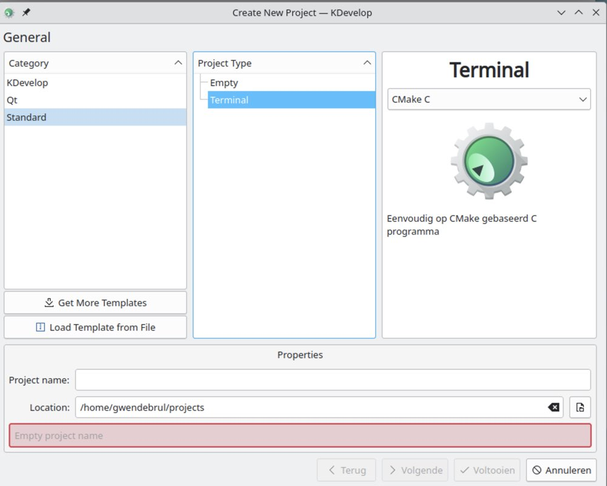
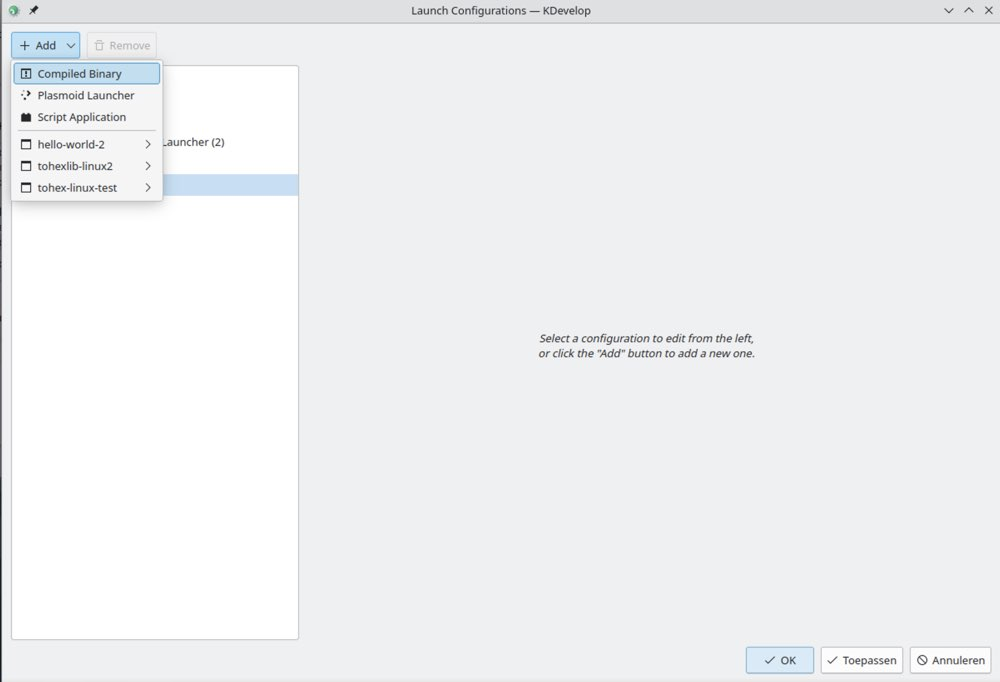
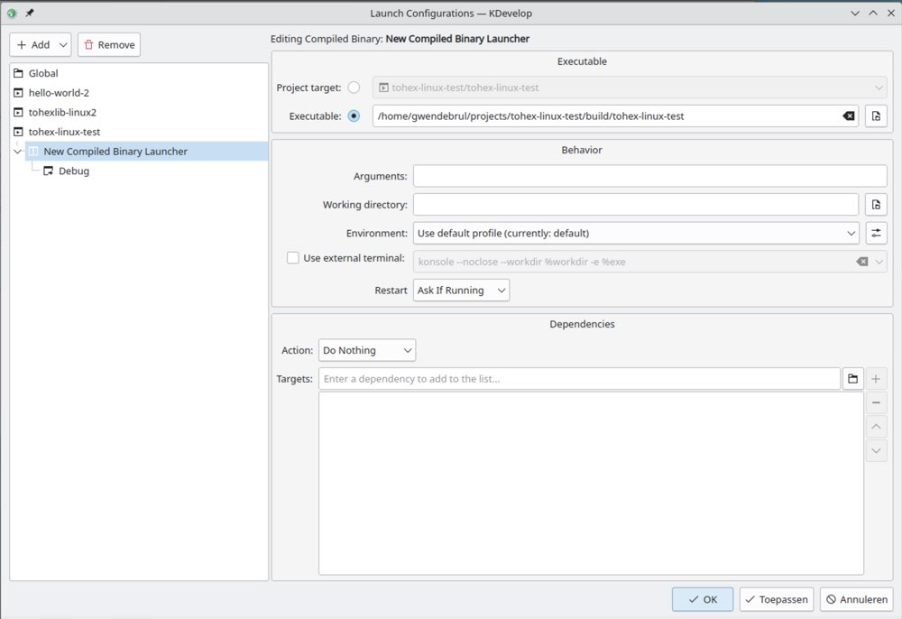
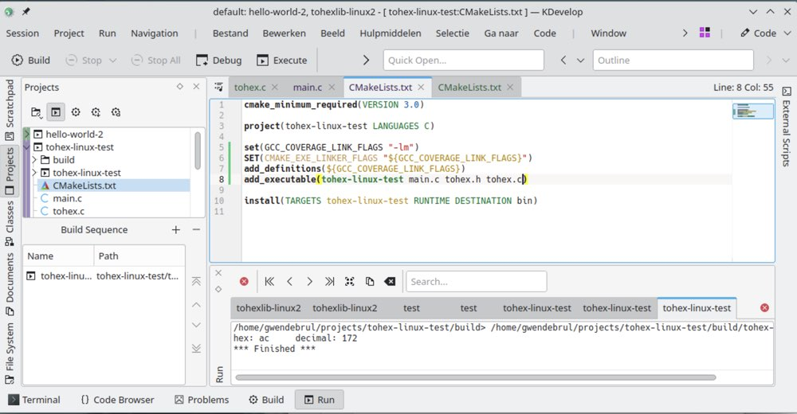

# Howto compile and execute a project in KDevelop

Last weekend I installed **openSUSE 15** as a **VM** in **Parallels Desktop for Mac**, the reason why will follow in another **blog** post.
After the installation I spend a couple of hours trying to get a simple project up and running.

For that reason I made this **blog post**, so I can reference it later or perhaps someone else is going through the same stuff.

## Make a project

This is very simple, you just have to choose your **category** and **project type**. For me it's a terminal program written in **ANSI C**

## Make Launch Configurations

The next thing you got to do is

    Run -> Launch Configurations
    
Choose 

    Add -> Compiled Binary
    

Then you have to specify the **executable path**

Use this structure

    <path to projects>/<project-name>/build/<project-name>
   
## Modify CMakeLists.txt

For my **project** I needed a custom **library file**, so I had to modify **CMakeLists.txt** to include my **header file**. I also needed to add a **flag** to use the **pow function** in **math.h**.

     set(GCC_COVERAGE_LINK_FLAGS "-lm")
	 set(CMAKE_EXE_LINKER_FLAGS "${GCC_COVERAGE_LINK_FLAGS})
	 add_definitions(${GCC_COVERAGE_LINK_FLAGS})    
	 
After setting the flag I needed to include the **tohex.h** and **tohex.c** to **compile** together with the **project**. This is only when you have to add some other **code files** that are not in the **system path**.

    add_executable(tohex-linux-test main.c tohex.h tohex.c)
    
Where **tohex-linux-test** is the project name. One thing I forgot to test was the inclusion of **tohex.h** in this line. Maybe you can just leave the **tohex.h** out of the **add_executable** line.

## The end ;-)

Now you can compile and execute your project. One thing to think about is when you click **run** and another project is being compiled and executed, you have to remove all the **projects** in **Launch Configurations** except the one you want to compile and execute.

That's it, if you have questions you can contact me on [Gwen De Brul on Github](https://github.com/gwendebrul)  