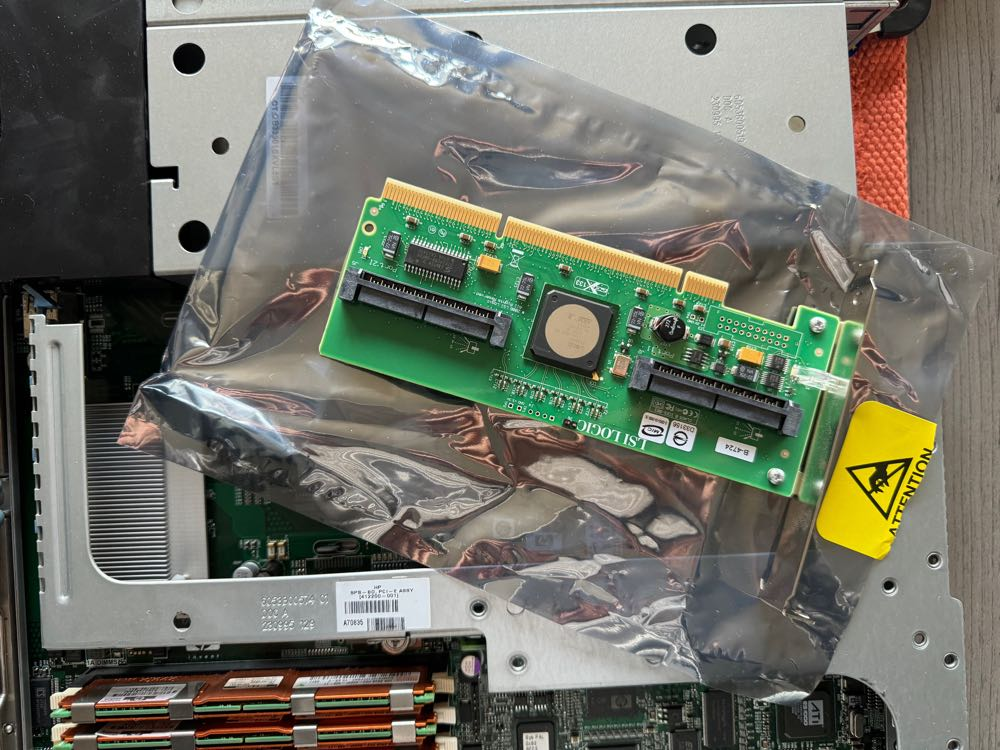
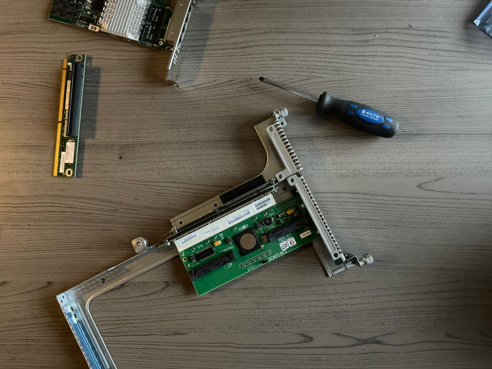

# Installation of a HBA controller in a HP Proliant DL360 gen5 server

## Preface

For a couple of years now I have a **HP Proliant DL360 gen5 server**. I use this **server** for streaming my **TV Shows** to my **Xbox One S** using the **Kodi** app on the **Xbox**.

The **server** came with a **RAID P400i controller**. The problem with this **controller** is that you can't do clean disks, you have to use **RAID 0** for just single disks. This **controller** also supports **RAID 1** but the **server** is turned off when not used to **stream** **TV Shows**. So **RAID** is not what I wanted.

After watching [My Playhouse](https://www.youtube.com/@MyPlayHouse) doing a video on the difference between **RAID** and **HBA Controller** I was sold on this idea.

With a **HBA** the disks are passed through to the **OS**, in my case **Ubuntu Server**. The benefit is also that the **server** doesn't need to be turned on all the time.

And after a couple of years I decided to purchase a **HBA**.

## Purchases

The first thing was to select a compatible **HBA controller**. It had to be compatible with a **HP Proliant DL360 gen5** server and it had to had internal ports, not external.

After some research I found this model **'LOT OF 2 347786-B21 HP 8-Port PCI-X SAS Host Bus Adapter 435709-001 435234-001'** on **eBay**. It was a listing from the USA. Bonus was there were 2 **HBA controllers** in this lot.

The next thing on the list was a compatible cable. The **HBA controller** that I just purchased on **eBay** had different ports than I used to see on other **HBA controllers**, a **SFF-8484** port to be specific.

The ports on the **backplane** are the regular **SFF-8087** type. So I went on google and found **‘HP (495973-003) MINI-SAS (SFF-8087) TO SFF-8484 CABLE 30"’** on [Bargain Hardware](https://www.bargainhardware.co.uk).

After waiting 4 days for the **HBA controllers** to arrive, it was very fast!. The cables came a week later after being stuck in customs.

So now I got everything I needed to do the transplant, or so I thought.

## Installation 

It was time to get the **server** out of the **boiler room** and crack it open. Took out the **riser** card and was ready to install the **HBA controller**, but it was a different **connector**.

The **HBA controller** had a **PCI-X** **connector** and the **riser** had a regular **PCIe** connector. The search for a solution started, but it didn't took long before I came across a **conversion kit**.

**‘HP 405154-B21 DL36X PCI-X CONVERSION KIT 405154-B21’** was the one I needed so I ordered it again from **eBay**. This time it came from Italy, so no customs and extra taxes ;-)

Installing the **conversion kit** was easy, but at first I made a mistake by taking out the wrong card.But after all it went all good.

## BIOS and Boot Order

After starting up the **server** while pressing **F10** at boot I came at a kind of **BIOS**. There I had to change the **Boot Order** to the **HBA controller**.

At boot I already had noticed the **HBA controller** was recognized.

The next step was erasing all the disks from **RAID 0**.

## Ubuntu Server installation

For the installation of **Ubuntu server** I decided to only use the **boot disk**, so i pulled out all the other disks.

Installing **Ubuntu server** was a breeze and it was time to push the other disks in after installation was complete.

## Adding disks

After login I opend the **terminal** to execute some commands which formats the disks to **ext4**.

	lsblk -f
	
With this command I got a look at what disks were mounted and which were new. You can also see the **UUID** which you need later in the **fstab** file.

Formatting the disks is done by executing following command

	sudo mkfs -t ext4 /dev/sd*
	
' * ' must be replaced with the letter of the drive which must be formatted.

After doing this for the other disks it was time to progress a little bit further.

The next step was making the mount points

	mkdir ~/series1
	
This has to be done for all disks to be mounted correct. You can choose whatever name you want.

After creating all the mount points it was time to update the **/etc/fstab** file. If this step is done then you can test the **/etc/fstab** file with following command

	sudo mount -a
	
If there are no errors then the file is good. Now one last step is to change the permissions on the mount points.

	sudo chown gwendebrul:gwendebrul /home/gwendebrul/series*
	
Again replace the ' * ' with the letter of the disk.

## Total cost

It was a pretty penny for this transplant, mainly because the shipping cost from the USA.

The HBA was $14,99 and $156,32 shipping in euro this was 167,23€. Customs was 7,94€

The cable was £10 and £4,99 shipping in euro 18,10€ and 23,62€ in customs.

As last the conversion kit was 20€ and 16€ shipping.

The total cost was 252,89€

But it was worth it!!

## One last thing

After connecting the **1.2TB disks** the server wouldn't boot anymore, it was stuck on the netboot loop. This was the result of connecting the cables the wrong way, I should have swap the connection, but that's for another time (when I have possible shorter cables).

The solution was to plug the **boot disk** out of its bay and put it in another bay.

Now It worked ;-)