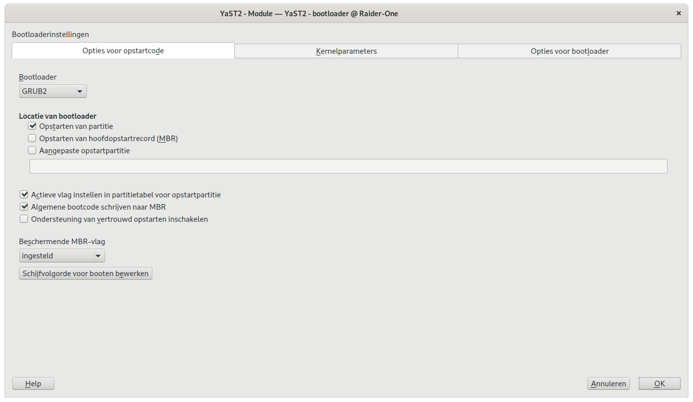
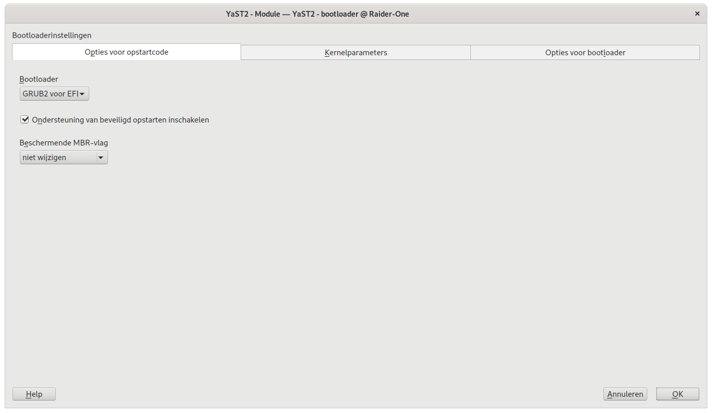
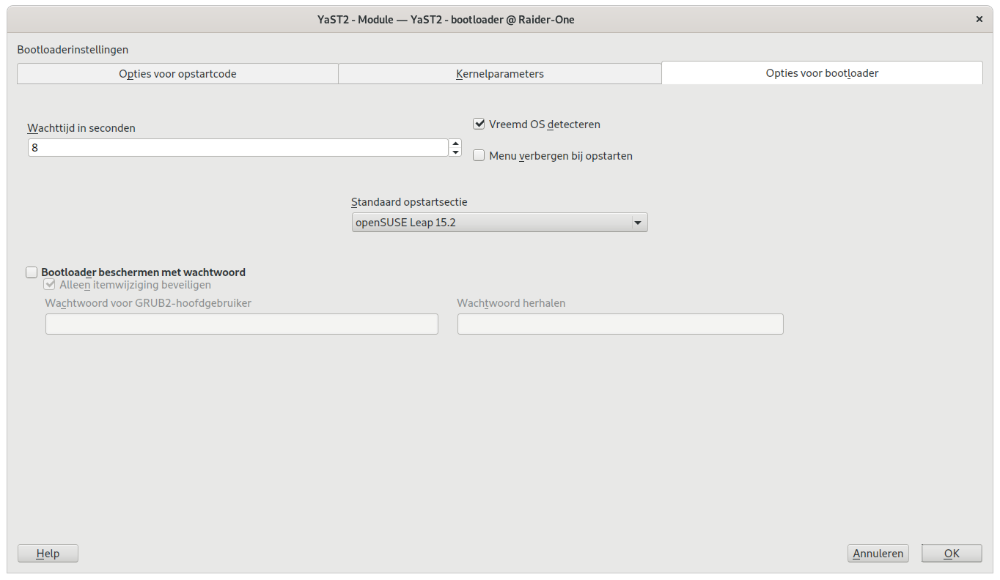

# Repairing GRUB on openSUSE

## Preface

I'm running **openSUSE 15.2** on my **mac mini** on an external **SSD**. I wanted to **format** my internal **Harddisk** to **ext4** to use in **Linux**. What I didn't really knew was that the **bootloader** probably was on the internal **harddisk**. After formatting the internal **harddisk** I no longer could boot into **openSUSE**.

So I had to reinstall the **bootloader**. This is possible from within the **recovery mode**, so I can boot of the external **SSD** again. After booted into **openSUSE** I had to do a couple of things to fix my mistake.

## Step 1 : Boot from USB installation disk

You must start your **Mac** with 'option' or 'alt' key pressed during boot, then you'll get an overview of all the bootabkle partitions. In my case I could choose between **Windows** or **EFI**. For some reason this always gave me an error when wanting to boot from the **Recover mode**, so I chose **windows**.

## step 2 : Boot into Recover mode

After pressing 'option' or 'alt' key on your **Mac** during boot a menu appears, where you can choose **Rescue System**. On the prompt you type 'root', a password is not needed.

To access the installed **OS** you have to do a couple of things, starting with

		tux > lsblk
		
This shows the **nodes** on a **disk**. Here you have to look for the **node** that contains the **root partition** (/).

In my system this was

		/dev/sdb3
		
Now you have to **mount** the **root partition** with following command

		tux > sudo mount /dev/sdb3 /mnt
		
There are 3 **partitions** you'll have to mount too

		tux > sudo mount -t proc none /mnt/proc
		tux > sudo mount --rbind /dev /mnt/dev
		tux > sudo mount --rbind /sys /mnt/sys
		
Now you have access to the system as **root** with following command

		tux > chroot /mnt /bin/bash
		
The next thing to do is **mount** all other **partitions** that are in the /etc/fstab

		tux > mount -a
		
Now you're going to make a new **GRUB Bootloader**, be aware that this won't fix it alone

		tux > sudo grub2-install /dev/sdb
		tux > sudo grub2-mkconfig -o /boot/grub2/grub.cfg
		
Now you can logout of the **rescue system** with following commands

		tux > umount -a
		exit
		reboot
		

## Step 3 : Configure the definitive version of GRUB Bootloader

Now you **reboot** the system again with choosing the **Windows** boot partition and choose **start up from harddisk**. if everything goes well you should be booting from your **openSUSE** installation.

Now you have to do 2 things so you can boot without the **USB Stick**. Press the **window** key and type **'bootloader'**, then press enter.

In the screen that's been presented you change the **bootloader** to **GRUB2**.

Click on **OK** and then you have to the previous step again to show the same window. But instead of **GRUB2** now you choose **GRUB2 for EFI**.

At the **options for bootloader** there's a selection box for choosing the **standard bootsection** there you have to choose the correct one, in my case **openSUSE LEAP 15.2**.

Press **'OK'** and now you should be able to boot up again from your **openSUSE** installation on the external **SSD** without using the **USB Recovery Stick**.	
