In this **blog** post I am going to tell you how to use **IFTTT Webhooks** for your own scripts. I use this method in a recent **[Mail IP Script](https://github.com/gwendebrul/mail-ip-script)**.

This **Bash Script** gets the IP Address of an **server** running **Ubuntu** and through the **IFTTT Webhook** it sends an e-mail (associated with your **IFTTT** account).

## Setup

Go to [IFTTT](https://ifttt.com), log in or create an account. When you have a working account click on the **CREATE** button.

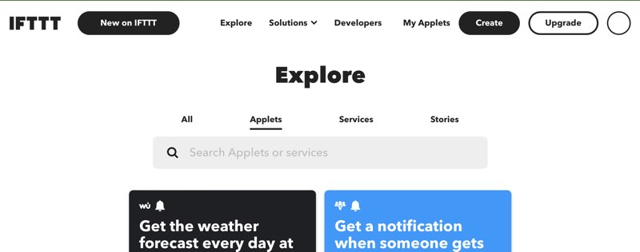

Then you get something like below

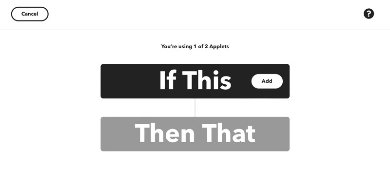

Click on **ADD**

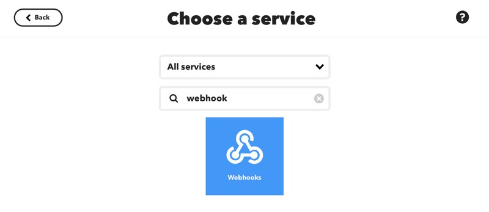

In the search field type webhook, then click on the square that says **Webhooks**.

You get the following page, where you can choose a **trigger** for the **webhook**.

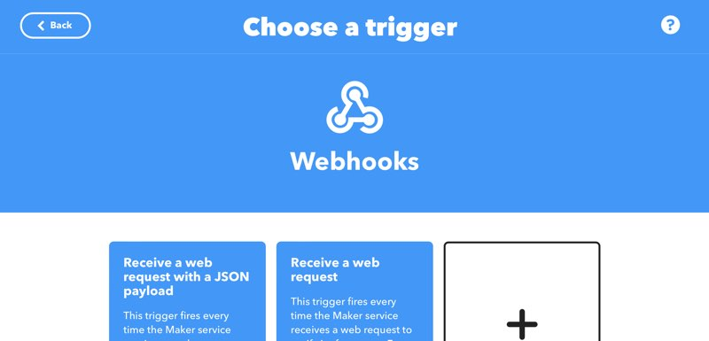

 Choose **Receive a web request**
 
 On the next page you're going to choose an **event name**, this will be in your custom **URL** for the **webhook**.
 
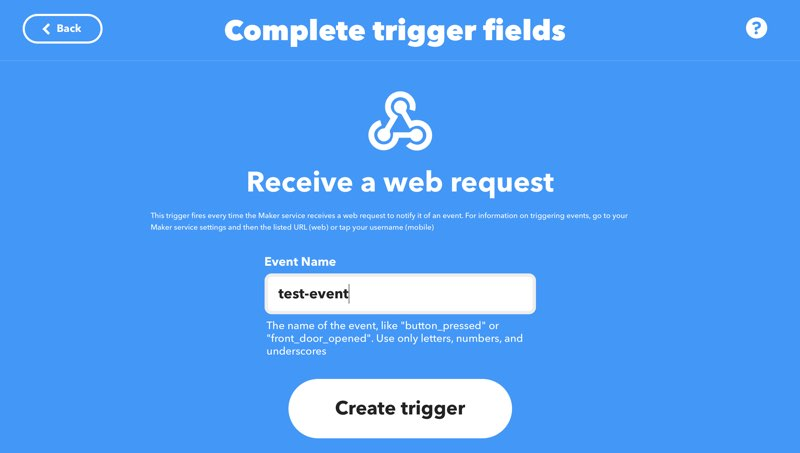

When you are ready click on **create trigger**.

On the next page you're going to choose an action for when the **trigger** is called (via curl).

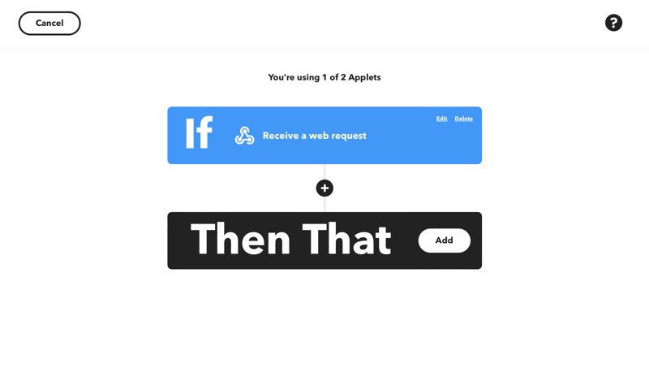

Click on the **ADD** button, then the next page loads

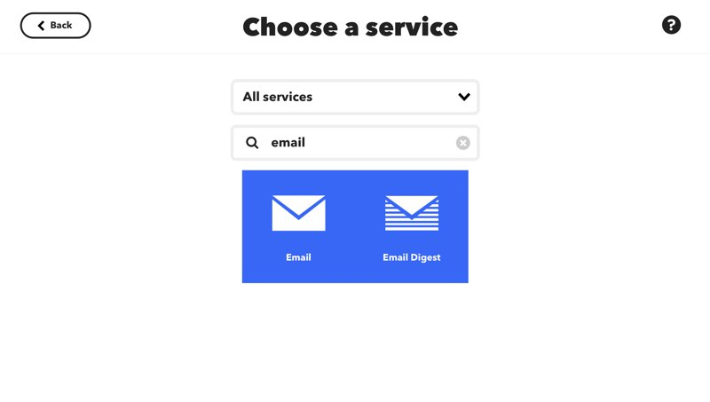

Again in the search field type **e-mail** and click on the **E-mail** square.

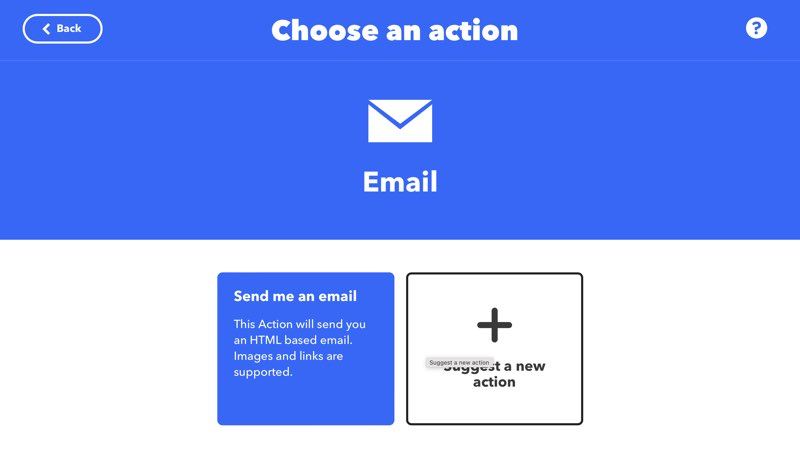

Here you're supposed to choose an action, in this case **Send me an e-mail**.

On the next page you can modify your **Subject** and **body** for the **e-mail** that get send.

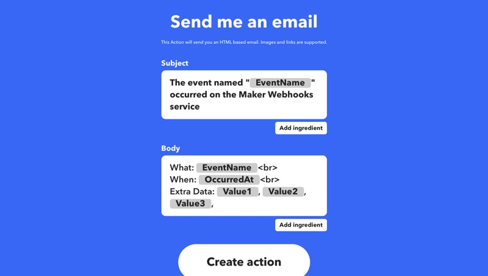

You can add your own text and add **ingredients**

An example of an **ingredient** is **OccuredAt**, you can add this by clicking on the **add ingredient** button or in the text field add

	{{OccuredAt}}
	
If you're happy with the **Subject** and **body** of the **e-mail** click on **Create action**.

The next step is to test the **event**. This can be done by surfing to [https://ifttt.com/maker_webhooks](https://ifttt.com/maker_webhooks)

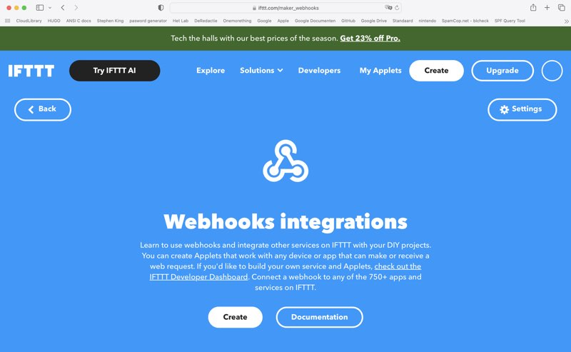

On that page you have to click on **Documentation** and you're being redirected to a custom page with all the info about your **event**.

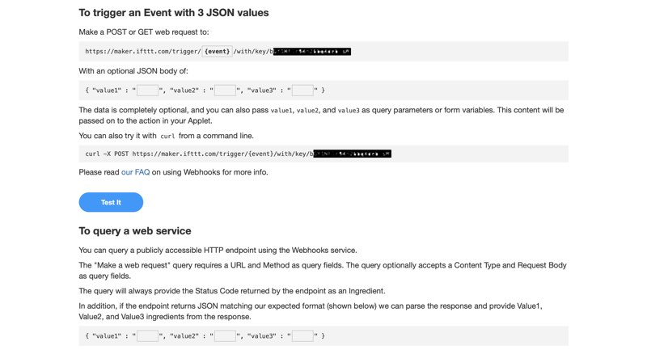

You can test your **event** by inputting your **event name** in the **URL** and optionally some values. Then click on **Test it**.

If this works you must copy the **curl** command on the page.

Example

	curl -X POST -H "Content-type: application/json" -d "{{\"value1\":\"whatever you want\"}}" https://maker.ifttt.com/trigger/<your event name>/with/key/<your key>
	
With that **URL** you can paste it in your own **script**.

That's All!!
