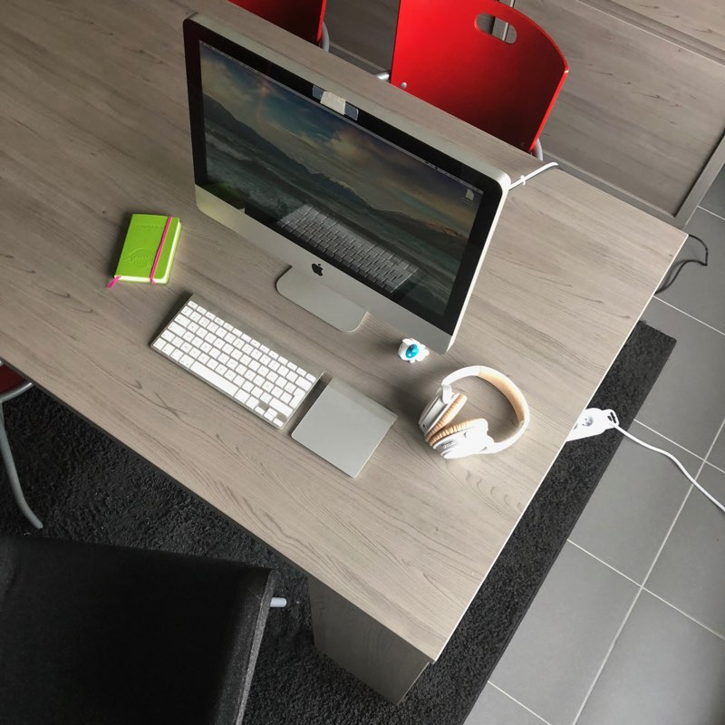
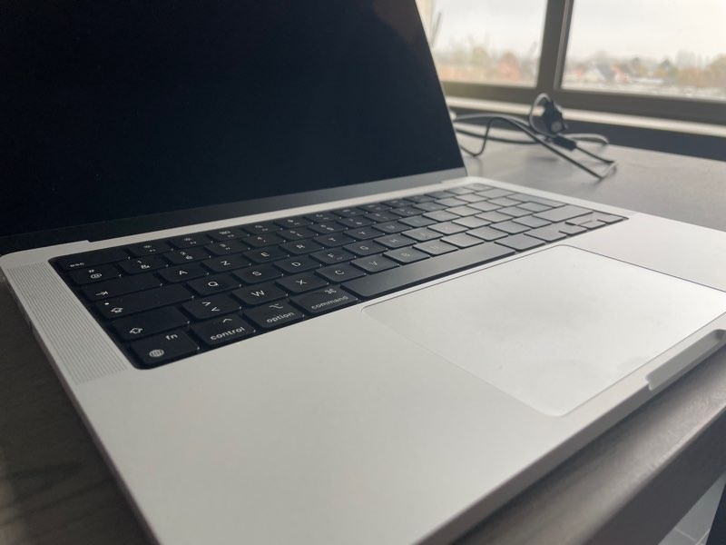

# #5 Laptop vs Desktop

## Preface

So the last two years I'm using a **14" M1Pro MacBook Pro** as a daily driver. Besides that I have a **HP laptop** and a **2014 Mac Mini**. The **HP laptop** is used for working with **VMs** as I'm working towards **LPIC-1** certification. The **mac mini** is used for **scanning** documents and **ripping** **movies** and **series**.

I also have a **HP Proliant DL360 gen5** server for **streaming** my **TV Shows**. Besides a **netbook** for **git** backup that's all I use at the moment.

I wasn't always a laptop user. For example I had an **2011 iMac** and before that a **G3 iMac Rev.b**. For this post I'm going to explain why I prefer **laptop** over **desktop** at the moment with some cons and pros for each.

So enjoy!!

## Desktop Pros

### Bigger and multiple monitors

This is a pro and a con for me. I love big **displays** but they take over a whole place. I work on my **dining table** as there's no real place for a desk in my **apartement**. I like minimalistic interior, in the sense of having little or no clutter at all. Only the necessary things. If I really want a bigger **display** I can always hook it up to my **laptop** via **hdmi**.

### More storage disks and cheaper

This is the biggest pro, having multiple spinning 3.5" **hard disks** for a reasonably price. If you have a bigger **desktop computer** case you can fit multiple **hard disks** in it. For working with **VMs** this is a plus.

### x86 architecture

For **virtualization** **x86** is a big benefit beacause older **linux** distros doesn't have **ARM** versions. I know you can use **Parallels 15** on an **M-series** mac but then you're limited to only the newer distros. If I want to virtualize **Mac OS X snow leopard** I need a **x86** architecture.

So only for this reason I use a **Windows 11** **HP laptop**. It has **16GB** ram and **512GB** SSD, both will be upgraded in a couple of months.

## Desktop Cons

### Power consumption

The biggest disadvantage having a **desktop** computer is the **power consumption**. In the best case scenario it uses 100watt an hour, so **0,1Kwh**. Having it on all day (10 hours) it uses **1Kwh** a day and **365Kwh** a year (**monitor** is not included). With the current prices for electricity that's 365x0,24€ => 87,6€ a year. That's not much but this is in the best case scenario. Besides that I like to use some older stuff that's plugged in at all time, like **AirPort Extremes** as **switches**.

My yearly **power consumption** was last year **1600Kwh**, but i reserve funds for **2500Kwh** if needed.

Maybe in the future I'll return to a **desktop**, but for now a **laptop** it is.

## Laptop Pros

### Power consumption

My **14" M1Pro MacBook Pro** uses 150watt per 2 or 3 days for charging, so **19,5Kwh** a year costing me **4,68€ per year**. The **HP laptop** when used is mostly plugged in, but not always. I use the **HP laptop** for 4 hours a day and even not every day, there are days I don't use the **HP laptop**.

So this is the biggest advantage a **laptop** has over a **desktop** computer.

### Less clutter on the dining table

A **laptop** makes less clutter on my **dining table**, I just use the **laptop** no accessories. It's also easy to move around in my **appartment**. For example during summer I work in my **bedroom/relaxing room** most of the times, because it's cooler there and I have a **TV** and **HiFi** setup in the **bedroom** too.

## Laptop Cons

### battery

The **battery** for a **laptop** is the biggest con, because they degrade after time. Of course you can swap the **battery** after a while but that's an extra cost. At **Apple** the **battery** swaps must be executed by a **technician**, but on my **HP laptop** I can do it myself.

## Summary

Altough every **computer** has it's advantages and disadvantages it's ultimatly your choice. For me at the moment **laptops** are the best choice, but that doesn't mean I'm never going back to using **desktops**. Only time will tell.