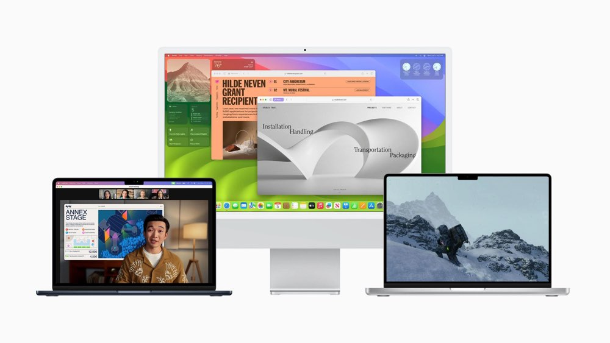
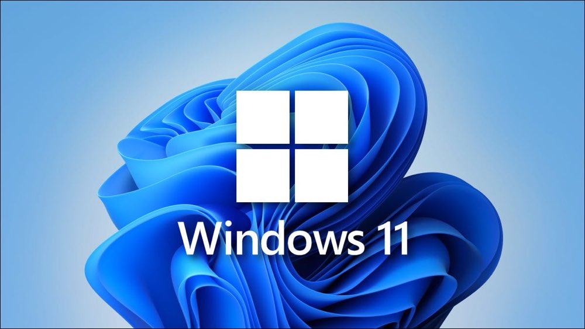
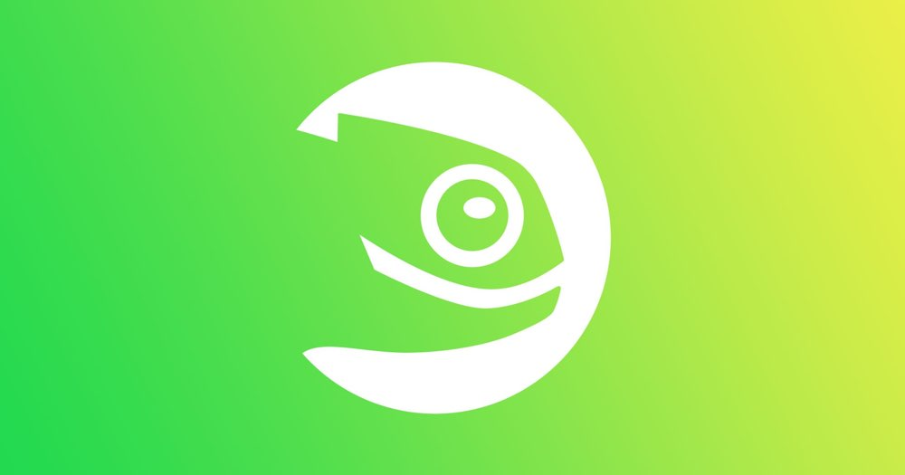
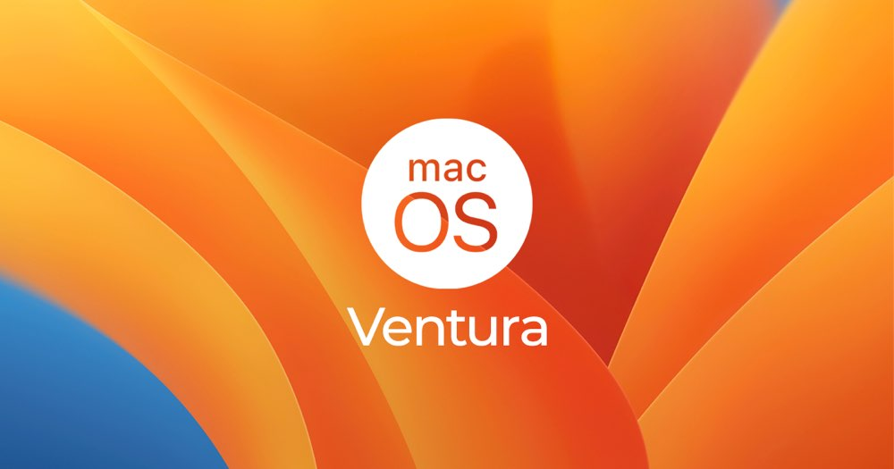

# Why I prefer macOS

## Some history

I started using **computers** in 1980s, then it were called **homecomputers**. My first real **PC** was a **Packard Bell Pentium** **desktop computer** somewhere around 1996, with **Windows 95**. After that first **PC** i had a few others, but early 2000s I bought my first **iMac G3 Rev B**. I bought it from my then girlfriend.

In the **Windows** days I first dabbled into **Linux** but it never became serious, at least **Linux** on the **desktop**. I do use **Linux** on **servers**.

Since I switched from **Windows** to **macOS** I never really looked back.

## Windows

I don't like it when I have to do stuff on **Windows**, it asks for updates left and right and the file explorer is slow.
These are the only reasons that I dislike **Windows**.

I have a **laptop** with **Windows 11** and it's ok but I still don't like working on it.

**Security** wise it's true there are very large volumes of **viruses and malware** but with a little bit of common sense and a free **Virusscanner** you can avoid getting a **virus**.

I do like the **Windows 11** interface, nice and clean.

## Linux

Well **Linux** ... I love that it's **opensource** and all the tweaking you could do, but that is the main factor keeping me from using **Linux** as a **daily driver** on my **desktop or laptop**.

For **servers** it's the best without a doubt, and I use as such. 

You could lose yourself in the tweaking and configurations and that's why I only use **Linux** on **servers**.

If **macOS** would go away and I must choose a different **OS** then it will be **Linux** of course.
Of all distro's I prefer **openSUSE** as a **desktop** version and **Ubuntu** as a **server** version.
In the early 2000s I dabbled into **Linux** for a bit and my system at the time was a **SUSE** distro, I don't remember the version.
But back then it wasn't really for everyday users, not that I am one.

**Hardware** compatibility has improved as well over the years, which is good, but I don't see everybody switching to **Linux**. That said [HCC](https://hcc.nl) computer club has a special group dedicated to **Linux** and it's in high demand from what I can tell.

## macOS

And finally **macOS** [cheers]. The one thing I can say about it is it's really stable. I don't have issues going on. At this moment writing this blog post I'm on version **Ventura 13.4.1**, altough there's a newer version, I like to wait before installing a new **OS** because of possible bugs etc and it's a hassle to reinstall completly (no upgrade).

The only thing I ran into on my **MacBook Pro 14"** is that my scanner (a **canon LIDE 110**) doesn't work anymore on **Ventura**. This is a bit of a bummer, but I have a **mac mini 2014** which does the job.

You can choose when and if you do updates, and most of the times it's quick and there are no problems updating the system.

It just works!!

And for me that's important, I like to do productive stuff like programming on my **computer** and not fixing and troubleshooting bugs all the time.

## Conclusion

**macOS** is my favorite **operating system** followed by **Linux**, and maybe one day I fully switch to **Linux** who knows?

For now I love my **MacBook Pro 14"** it's build quality and battery life is fenomenal, no other **computer** can match it in my opinion.

So **macOS** for the win!