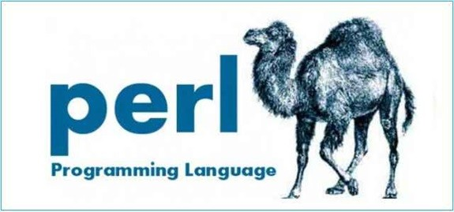

# Install Perl 5.38.2 on Mac OS X 10.6.8

## Why

So I bought two **xserve servers** for 80€ from a Dutch guy. Since I started with my own **server** the **HP Proliant DL360 gen5** I wanted an **xserve**, and now I have two ;-)

One **xserve** will be working as a **HTTP File Server** and **Work environment for Perl scripts**. The second **xserve** I'm not sure yet on how to use it it if use it at all. There's a chance I resell the second **xserve** because I don't have a use for it yet. Otherwise I could install **ubuntu 22.04 LTS** on it and use it for samba share.

But that's farther down the line.

So for now I want to install a newer version 5.38.2 of **Perl** on the first **xserve**

## Requirements

- Mac OS X 10.6.8 (**Server**)
- xcode 3.2.6 (to install **Perl** from source or install MacPorts)
- Perl 5.38.2.tar.gz
- cpanm.pl (to install modules)
- MacPorts (for lighttpd and git)

## 2 ways for obtaining Perl

You can obtain Perl via a curl command

	curl -O https://www.cpan.org/src/perl-5.38.2.tar.gz
	
But this requires a newer curl **SSL** and that's not installed by default on **Mac OS X 10.6.8**. So if you want to go the route of curl you should install **MacPorts**.

	sudo port install curl

You'll need **MacPorts** anyway. But my solution was the second one (this is you can host your own versions of **Perl** on an **HTTP File Server**).

The second way is to download **Perl** from the website and make sure you can access this on the target system. I did this by copying the **Perl** tarbal to a **smb share** on my **NAS** which can be accessed via **SSH**

If you got **Perl** you can go on with the following step.

## Untar Perl

To untar or unzip **Perl** use the following command

	tar -xzf perl-5.38.2.tar.gz

then get into the directory by typing
	
	cd perl-5.38.2
	
The next step is to configure, make and install the newest version of **Perl** (5.38.2) that you obtained in the previous step.

	./Configure -des -Dprefix=/usr/local/
	make
	make test
	sudo make install
	
This can take quit a while and you have to type the 4 commands individually when the previous one is complete.

Now you have installed **Perl 5.38.2** in /usr/local/bin

## Installing modules

Modules can be installed in /Users/<username/perl5 via cpanm.pl script that you already had downloaded in the requirement step.

	/usr/local/bin/perl5.38.2 cpanm.pl XML::LibXML
	
This installs the module **XML::LibXML**

## Usage of the new Perl installation

At the beginning of the script you have to add the **shebang** line. Usually this is

	#!/usr/bin/perl
	
But to use the new version you have to add this slight variation

	#!/usr/local/bin/perl5.38.2

If you want to add a module you have to include the folder in which the installed modules live. For me that is
		
	use lib '/Users/<username/perl5/lib/perl5'
	
Now you can use modules in your scripts.

## Conclusion

This was an failry easy way to install a newer version of **Perl** on **Mac OS X 10.6.8**
