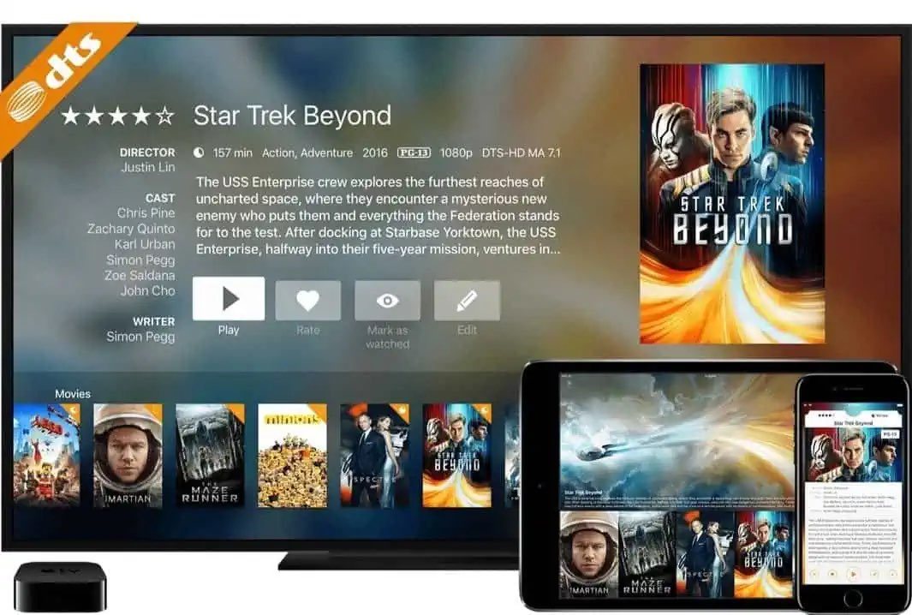
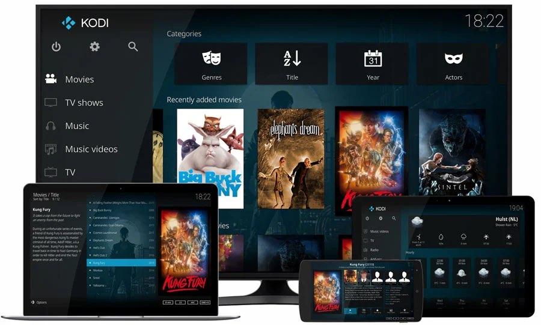

# #6 Plex vs Infuse vs Kodi

## Preface

So I wanted to **digitize** my **movies** and **tv shows** physical disks, the search begun on google. I knew that it was possible thru **dlna**, but it lacks pretty **covers**. Thus searching further, more on that below.

But finding the right **frontend** was half of the work, I would need something to store the **digitized** content on. It could be a **harddisk** that I somehow connect to my **xbox one s** but then I couldn't **stream** the content to my **Apple TV 4K**. 

I had a **QNAP TS-251 NAS** laying around but wasn't a great fan of the **interface**.
With that in mind I bought myself a **real** **server**, A **HP Proliant DL360 gen5** specifically, this would do it, and so it all began.

## Plex

On **youtube** there is a huge number of video's about **Plex Media Server**, and it looked good. So I installed **Plex** on my **QNAP Nas** and fired it up.

Immediately I ran into a hurdle, the **QNAP Nas** wasn't powerfull enough to **transcode** my **1080** content. The movie will **buffer** every few seconds, very irritating.

That was a bummer because **Plex** looked good with it's **movie** and **tv shows** covers, it was an eye pleasing app.

Further searching unveiled that it was possible to stop **transcoding**, but for an unclear reason I didn't get that working. It's possible that in the future I will revisit **Plex** and really dig deep to solve the **transcoding** problem.
I don't need **transcoding** because I only view the **movies** and **tv shows** on my **TV**.

Another thing I discovered was that the **cover art** of **tv shows** was a bit dodgy on **infuse** on my **Apple TV 4K**. No matter what I tried I couldn't get for example **V the original series** and **V (2009)** to show separately **cover art**. So I need to see if this is a problem in **Plex** too.

So I will revisit **Plex Media Server** someday and give it another try, but for now I stick to another solution.

## Infuse

This app on my **Apple TV 4K** looks very promising with it shiny **cover art** and simplicity. But there are two problems.

The benefit is that it didn't need to **transcode** anything, it just works streaming the file from my **server** or **nas**. It connects to the **server** or **nas** through **samba** and this is simple enough.

Now the first problem is that after a while I needed to rescan and build the library in **infuse**. The data goes away on my **Apple TV 4K** after a while, maybe it's not an **infuse** problem but a storage problem on my **Apple TV 4K**. I'm pretty sure it has **32GB** of storage and maybe that's not enough to retain the library data. 

On my **Apple TV 4K** I have the dynamic **screensavers** on and once in a while it downloads new **screensavers**, maybe that's the problem.
In fact I will turn this feauture off to test if this is the problem of not retaining the library data.

Another problem is **tv shows** and it's **cover art**. No matter what I try I couldn't get it working correctly. For example **V The original series** and **V (2009)** show in one **cover art** and there's no way you can see which episode is which. Another **tv show** that doesn't work correctly out of the box is **Battlestar Galactica (2004)** and **Battlestar Galactica (1984)**. But with this show I can split them manually (not with **V (2009)**).

So every time the library data must be rescanned I have to change these 'errors', which is annoying. I tried different naming strategies based on **IMDB** but that's not working as it should. Maybe it uses a different **API** to check the **cover art**.

When I have a little bit of time I will check which **API** infuse uses and test it out.

## Kodi

Another app I looked into and use to this date is **kodi** on my **xbox one s**. And it's not perfect too. I don't like the navigation. For example If you go to see all the **movies** on an overview it show it as a list of **movie** titles without showing the **cover art**. In the case of **tv shows** this is not true, these show up with **cover art** in a side scrolling container. It would be nice if they layout in a grid instead of a side scrolling container.

**Kodi** does the title naming very good, Ther are no errors.

A while ago before the latest update of **kodi** it suddenly stopped working, I couldn't connect anymore to **samba** shares. That was a reason to switch to **infuse**.

Until now I'm using **kodi** on my **xbox one s**, but that will be changing now.

## Conclusion

While writing this **blog** post I reinstalled **Plex Media Server** on my **HP Proliant DL360 gen5** server and gave it another try. I turned-off video **transcoding** and re-arranged some **tv shows** naming and now it works great. Everything shows up and is correct.

I just saw an episode of **Miami Vice** (**DVD** rip) and a bit of **Picard** (**Blu-Ray** rip) and there was no buffering. So for now I will be using **Plex Media Server** for streaming my **tv shows** and **infuse** will be used for **movies**.