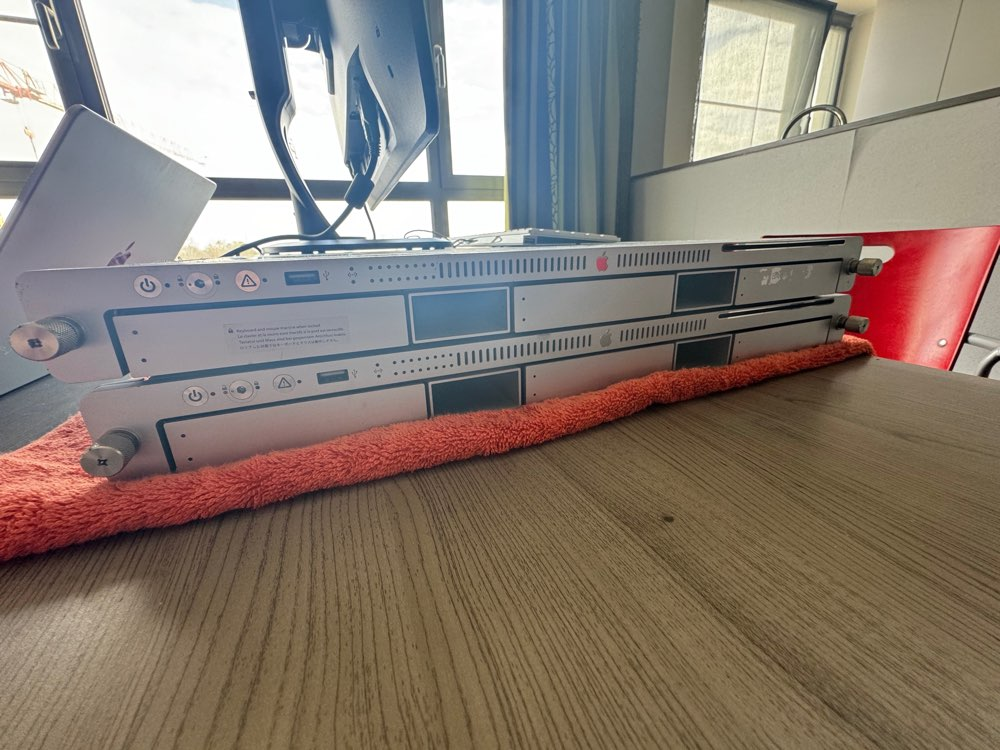

# Xserve 2008 in 2024

## Beginning

At the end of March 2024, I bought 2 **Xserve servers**, second-hand of course. Since I bought my first **server** in 2019, an **HP Proliant DL360 Gen 5**, I've been curious about the **Apple Xserve**. I finally made the decision and went looking for one.

On Marktplaats, I found an offer selling 2 **Xserve servers**, a 2008 model and a 2009 model. According to the seller, the 2008 model was working fine, and the 2009 model couldn't boot from the **SSD**. Despite this, I went ahead with the purchase and tested them at home.

The 2008 model indeed worked fine and was ready to go, except for one upgrade, more about this in the 'hardware' section.

The 2009 model indeed wouldn't boot from the **SSD**, but it did boot from a regular **hard drive**. So, I removed the **SSD**. There’s something else about this model that I don’t like: **RAID**. The backplane is a **RAID** controller instead of a regular **SAS** controller. I thought about replacing it with a **SAS** controller, but these are hard to find, and if you do find them, they cost around €300. So, that's on hold for now, and more about the 2009 model will follow later.

## Hardware

The model works fine, though I did add a **PCIe SSD**. Before, it took 54 seconds to boot, and with the **PCIe SSD** only 11 seconds.

Additionally, this model has 3x **2TB hard drives** as backups, which I don't use for anything else.

It has 2 **Quad Core 3GHz Intel Xeon** processors with a total of 4GB of RAM.

### Cost

The server itself cost €40, which was a real bargain. The **OWC Accelsior PCIe** card cost €39.82 on [Amazon.com.be](https://amazon.com.be). The **SSD** was repurposed from a previous project and was therefore free, and is a **500GB SSD**.

## Perl Development Environment

It was important for me that a newer version of **Perl** was possible, and it turns out that the latest version **5.38.2** can be installed.

I did this via [MacPorts](https://www.macports.org), which I also needed for **git** and **lighttpd**.
Now I use the **server** for **programming** **Perl scripts**.

I am particularly interested in **programming** **CGI scripts** as a **backend** for **web applications**.

**Perl** is an interesting but somewhat strange **programming language**, especially with all its special **variables**.

To test the **CGI scripts**, I use **lighttpd** as the **web server**, which can also be installed via [MacPorts](https://www.macports.org).

## PHP Development Environment

Since I will soon start a course on **web development**, I also wanted to run **PHP** on the **Xserve**. The latest version 8.3.8 can be installed via [MacPorts](https://www.macports.org).

Additionally, I need **MySQL**, though I'm not sure which version. Version 5 can still be installed on this **Xserve**, but newer versions cannot. This can be solved with an **Ubuntu VM** with **MySQL**.

Now, I should explain the **OS** running on the **Xserve**. It’s **Mac OS X 10.6.8**. This was supposedly the second-to-last version that was compatible. Further research showed that **Mac OS X 10.11** is the last **non-metal** version that works with the built-in **GPU**.

For now, I'll stick with **Mac OS X 10.6.8**, as I have good memories of it ;-)

As with the **CGI scripts**, I test these through **lighttpd**.

## Visual Studio Code

As an **IDE**, I use **Visual Studio Code**, which can also edit files on an **SSH server**, though not in the way I initially wanted. The plan was to use the **SSH remote** plugin in **Visual Studio Code**, but this didn’t work, probably due to the old **OS Mac OS X** on the **Xserve**.

So, I did it another way: **mounting** folders via **SSH** in the **Finder/explorer**. When these folders are mounted, they can be accessed and edited through **Finder/explorer** as you would any other hard drive.

### Access files via SSH

In **MacOS 13** and earlier, and probably later versions, you can use these in **Finder** without doing anything. The **Xserve** simply appears in the left sidebar of **Finder**, and if you connect with the correct username, the home folder is available in **Finder** and thus in **Visual Studio Code**.

Note that **file sharing** must be enabled on the **Xserve**.

For **Windows 11**, it was a bit trickier. Just creating a **network connection** wasn’t possible, probably again due to the old **Mac OS X** version. So, I searched further and found a tool to mount folders via **SSH**, called **SSHFS**. After installation and testing, it still didn’t work.

I used

	\\sshfs.k\user@xserve

and this kept giving errors. I’m not one to give up easily and kept looking for a solution. Usually, I take a break from the **computer** and do other things before returning to the problem.

After more Googling and reading the **SSHFS** manual, I saw that you can specify a port. I assumed it was default port 22 for **SSH**, as I connect via **SSH** through the **terminal**. But I tried specifying the port anyway:

	\\sshfs.k\user@xserve!22

And now it worked. Strange that you need to specify the port even when using the default port.

The '.k' in 'sshfs.k' is necessary if you use **SSH keys**, which I highly recommend.

Now I could open the **Xserve** folder in **Visual Studio Code**.

## Git

Since I use the **Xserve** as a development environment for **Perl scripts** and my web development course, I need access to git. This was easily installed via [MacPorts](https://www.macports.org).

I have 2 places where I store my **git repos**: a **server** at home and **GitHub** for an offsite backup.

For the home **server**, I use **SSH keys**. **GitHub** switched from regular **RSA** to **ed25519**, so I had to create new **SSH keys**.

After some time, I finally got **GitHub** to work for my projects on the **Xserve** (**Perl** and **web development**). The challenge was that I still use old **SSH keys** on other computers, though they now use **ed25519**. Only the **Xserve** with **Mac OS X 10.6.8** doesn’t support the new **SSH keys**.

You can still use **RSA** on **GitHub** but need to create them like this:

	ssh-keygen -t rsa -b 4096 -C "your_email@example.com"

So, I created new **SSH keys** and opted for **ed25519**.

## Offline Websites

Lastly, I use the **Xserve** to **host** downloaded **websites** that I can access when my **internet** is down.

More about this in [Offline Websites Blog Post 010](https://github.com/gwendebrul/blog/tree/main/2024/010%20offline%20webpages).

## Conclusion

The **Xserve** 2008 model with **Mac OS X 10.6.8** is still perfectly usable in my case, though I might upgrade it to **Mac OS X 10.11** in the future. But for now, it’s fine ;-)

For **Perl** and **PHP** development environments, this **Xserve** is still useful. Along with **offline websites**, that’s all I can think of for what an **Xserve** is still good for.

Maybe you have other ideas for using an **Xserve** in 2024 or later.