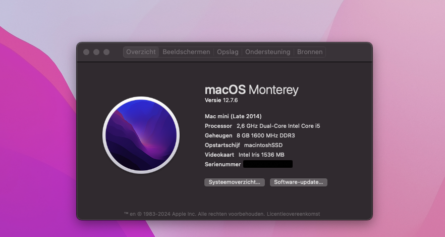
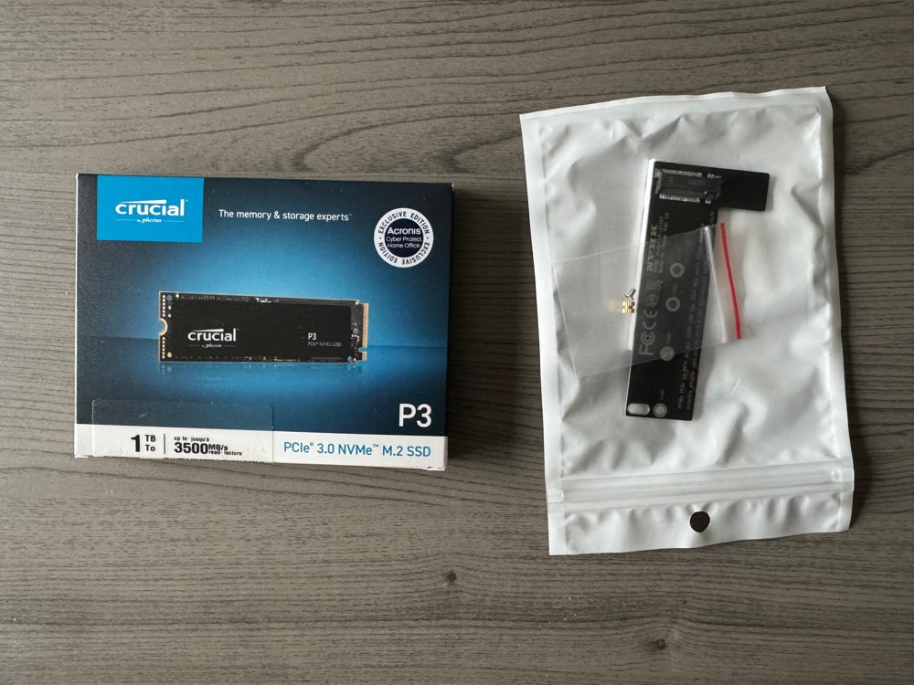
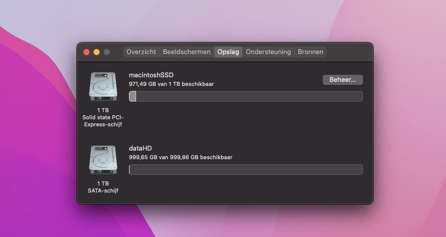

# mac mini 2014 upgrade

## begin

Jaren geleden heb ik een **mac mini late 2014** tweedehands gekocht om hem te gebruiken voor de **scanner** en omzetten van **DVD** en **Blu-Ray** naar digitale bestanden voor te **streamen**.

Al die tijd had ik een **externe** **mSATA** **disk** eraan hangen die diende als opstartschijf met het **besturingssysteem** **macOS**.

Een paar maanden geleden dan ben ik op een **youtube** video gestuit die liet zien dat je een **NVMe** **disk** kon inbouwen en de huidige **harddisk** kon behouden. Gedaan met de **externe** **disk**.

Dus zo gezegd zo gedaan en de onderdelen besteld.

## onderdelen

Als eerste had ik een adapter nodig die je kon aansluiten op de ingebouwde **PCIe** poort in de **mac mini**. Die kon je dus gemakkelijk vinden op zowel **eBay** als **Amazon**.

Ik heb de mijne besteld op [amazon.com.be](https://www.amazon.com.be/dp/B093DJYG9G?ref=ppx_yo2ov_dt_b_fed_asin_title&th=1) 

Het tweede onderdeel was de **NVMe** **disk** zelf, ook deze heb ik gekocht op [amazon.com.be](https://www.amazon.com.be/dp/B0C2WGL8DQ?ref=ppx_yo2ov_dt_b_fed_asin_title)
Dit is een **Crucial 1TB NVMe disk**.

Met de onderdelen in huis ben ik begonnen aan het installeren van de upgrade.

## hardware installatie

Op [iFixit](https://nl.ifixit.com/Guide/Mac+mini+eind+2014+Vervanging+van+de+SSD/32646) heb ik de handleiding gevonden om de **Fusion drive SSD** te veranderen, maar bij mij was er niets op die plaats. de **mac mini** had enkel een **1TB harde schijf**. Maar de stappen om de **mac mini** te openen waren hetzelfde dus met deze handleiding in de hand (eigenlijk op de computer ;-)) vatte ik het installatie proces aan.

De installatie op zich verliep vlot al moest ik wel een tweede keer de **mac mini** openen omdat de **NVMe** disk niet goed was aangesloten.

Met de hardware installatie goed gelukt kon ik het **macOS** installeren, dat dacht ik toch.

## macOS installatie

Toen ik opstarte van een **bootable** **USB stick** met **macOS Monterey** erop leek de **NVMe drive** niet zichtbaar in **schijfhulpprogramma** en dus kon ik ook niet het **macOS** installeren.

En wat doe je dan als er iets niet lukt? gewoon google gebruiken. Al snel kwam ik een artikel tegen dat melding maakte van hetzelfde probleem dat ik had en wat bleek. Je moest **macOS Monterey** al eerst op de ingebouwde **harde schijf** geinstalleerd hebben voor de **NVMe** **drive** beschikbaar is (kwestie van firmware of iets dergelijks).

Dus de volgende stap was **macOS Monterey** op de ingebouwde **harde schijf** installeren. Dat ging redelijk vlot, een 45 minuutjes denk ik. De **USB stick** was **USB 2.0** vandaar dat het trager gaat en het feit dat dit op een gewone **harde schijf** werd geinstalleerd.

Als dit gedaan was kon ik eindelijk **macOS Monterey** op de **NVMe drive** installeren. En deze keer werd de **NVMe drive** echt herkend. Na alweer een 30 minuutjes was dit volbracht.

Als laatste dan de originele ingebouwde **harde schijf** gewist zodat de **macOS Monterey** installatie enkel nog op de **NVMe drive** stond.

## gebruik

De **mac mini** wordt dus **headless** gebruikt voor voornamelijk mijn **Canon lide 110 scanner** en **makeMKV** voor het rippen van **DVD** en **Blu-Ray**. Ik kan ook het scherm delen zodat ik vanaf mijn **macbook** toegang heb tot het 'beeldscherm' van de **mac mini**.

Voorts gebruik ik hem ook voor het testen van een andere **IDE** voor mijn **Perl** scripts, namelijk **VIM**. Ik ben bezig met een opleiding **webontwikkelaar** en daar gebruikt men **Visual Studio Code** met drie zeer handige features, namelijk **format document**, **emmets** en **LiveServer**.

En deze wil ik ook ter beschikking hebben in **VIM**. daar gaat heel wat testen bij kijken en dat doe ik liever niet op mijn dagelijkse **computer**.

## kosten

- De **NVMe drive** kostte uiteindelijk 66,99€
- De PCIe adapter was 12,99€

Dus totaal 79,98€

Dit was zeker de moeite waard, eindelijk verlost van de externe **mSATA disk** en een vrij recent **besturingssysteem** namelijk **macOS Monterey**.