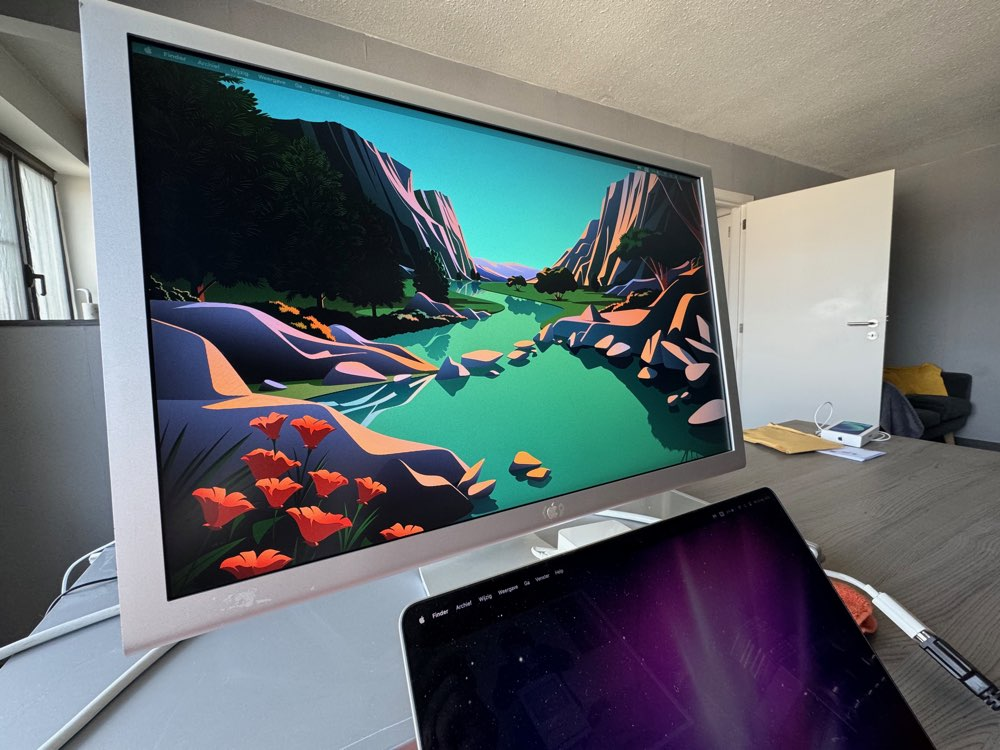
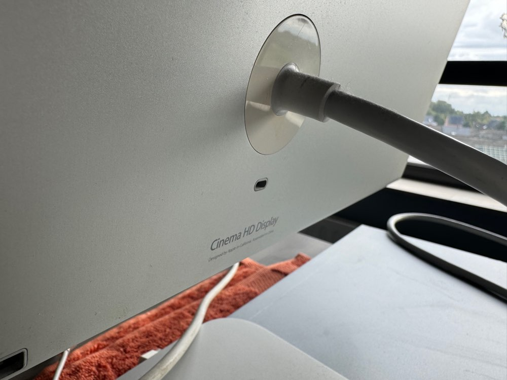

# Apple Cinema HD Display 23"

## begin

Voor mijn studie **webontwikkelaar** wou ik een 2de scherm voor mijn **macbook pro 14" M1 PRO**, dit geeft meer schermoppervlak voor het maken van **HTML/CSS** pagina's.

Nu had ik al een 27" **iiyama XB2779QS-S1** monitor, maar dat is een lelijk plastic ding, qua monitor is dat wel een goede, maar het design is dus niet mijn ding.

Dan ben ik me maar gaan verdiepen in een **Apple** monitor. Daar had ik de keuze tussen

1. Cinema HD Display 23"
2. LED Display 24"
3. thunderbolt Display 27"

Nummer 2 en 3 vielen af omdat deze een **displayport** of **thunderbolt port** hadden. Nu wou ik iets dat ook gemakkelijk zou aan te sluiten op computers met **DVI**, hoe dikwijls ik dit nodig zou hebben is ook te verwaarlozen maar ja ;-)

En de **Cinema HD Display 23"** vind ik mooier dan de twee anderen.
Dus een **Cinema HD Display 23"** ging het worden.

## zoektocht

De zoektocht was zeer kort ;-) Ik had direct een kandidaat die de **Apple Cinema HD Display 23"** verkocht en in de buurt was van waar ik woon. Dus afspraak gemaakt en gaan halen.

Ondertussen voor ik de **monitor** ging halen las ik ook dat er een dingetje was met de **power supply** van deze **monitor**. Je had er met 65w of 90w, die met 65w gingen nogal dikwijls stuk omdat de **monitor** eigenlijk meer nodig had. Dus dat was wel een dingetje dat ik in mijn achterhoofd had, maar de 90w versie was nog wel te vinden online. Uiteindelijk zat de 90w versie bij de aankoop, wat dus een meevaller was.

De verkoper zei dat de **monitor** werkte en dat was dus ook het geval. Ik heb de neiging om de mensen te geloven op hun woord ;-)

## bouwkwaliteit

)

Eén van dse redenen dat ik de **Cinema HD Display 23"** gekozen heb is omdat deze gemaakt is van aluminium en dus zeer stevig is. Hij weegt dan ook wel wat, een 10kg als ik me niet vergis, maar ja hoe dikwijls moet je je **monitor** optillen ;-)

Hij is wel kantelbaar maar niet in hoogte te verstellen dus daar moest ik nog een oplossing voor vinden, maar ondertussen heb ik een **monitor** standaard gevonden die past. De monitor moet boven het opengeklapt scherm van mijn **macbook pro 14" M1 PRO** komen en dus een 5 à 7 tal centimeter hoger moeten zijn dan dat de **monitor** standaard is.

## aansluitingen

Deze **monitor** gebruikt dus een **DVI** aansluiting en heeft 2 **USB-A 2** aansluitingen en 2 **FireWire 400** aansluitingen. Nu is er al veel geschreven over de aansluitkabel dat die veel te kort is en dus op de tafel moet gelegd worden, daar wou ik geen genoegen mee nemen dus heb ik een oplossing gezocht en gevonden.

Ik heb een **DVI** naar **USB-C** adapter gekocht namelijk [logilink dvi to usb-c adapter](https://www.amazon.com.be/dp/B06XNJK99N?ref=ppx_yo2ov_dt_b_fed_asin_title). Dan heb ik een verlengkabel voor **USB-C** gekocht, namelijk deze [Drivv USB-C verlengkabel](https://www.bol.com/be/nl/p/drivv-usb-c-3-2-male-naar-usb-c-female-kabel-fast-charge-snellader-usb-c-data-en-oplaadkabel-2-meter-o-a-samsung-iphone-15-meer-grijs/9300000176760754/?bltgh=f1119018-aba4-40be-bebf-3b334a7c1688.wishlist_details_page_products.WishlistDetailProductCardItem_2.ProductTitle)

En voila probleem opgelost de **power brick** ligt nu gewoon op de grond, waar hij hoort.

## beeldkwaliteit

Qua **beeldkwaliteit** ben ik zeer tevreden. Het is een niet-reflecterend scherm en de kleuren zijn zeer goed. Ik weet dat dit geen 4K of zelfs 5K is maar om eerlijk te zijn heb ik dat ook niet nodig met mijn slechte ogen ;-) De resolutie van de **monitor** is 1920x1200 op een diagonaal van 23". Dit is voor mij de sweet spot omdat de **monitor** dan niet te groot is maar toch duidelijk leesbaar voor mij.

## totale kostprijs

De **Apple Cinema HD Display 23"** zelf heeft me 50€ gekost. De adapter 23,43€ en de verlengkabel 14,99€.

Dus het totaal was 88,42€ wat echt wel een koopje is voor een scherm van deze kwaliteit en van 20 jaar geleden.

## conclusie

Voor 88,42€ heb ik een mooie **monitor** met voor mij een zeer goede beeldkwaliteit en het is van **Apple** ;-)
Ik heb de neiging om oudere apparaten van **Apple** leuk te vinden, vandaar dat mijn netwerk ook draait op **Apple Extreme's**.

Als je echt 4K of 5K wilt of een hogere **refresh rate** dan moet je deze **monitor** niet kopen, maar anders kan ik hem wel echt aanraden.