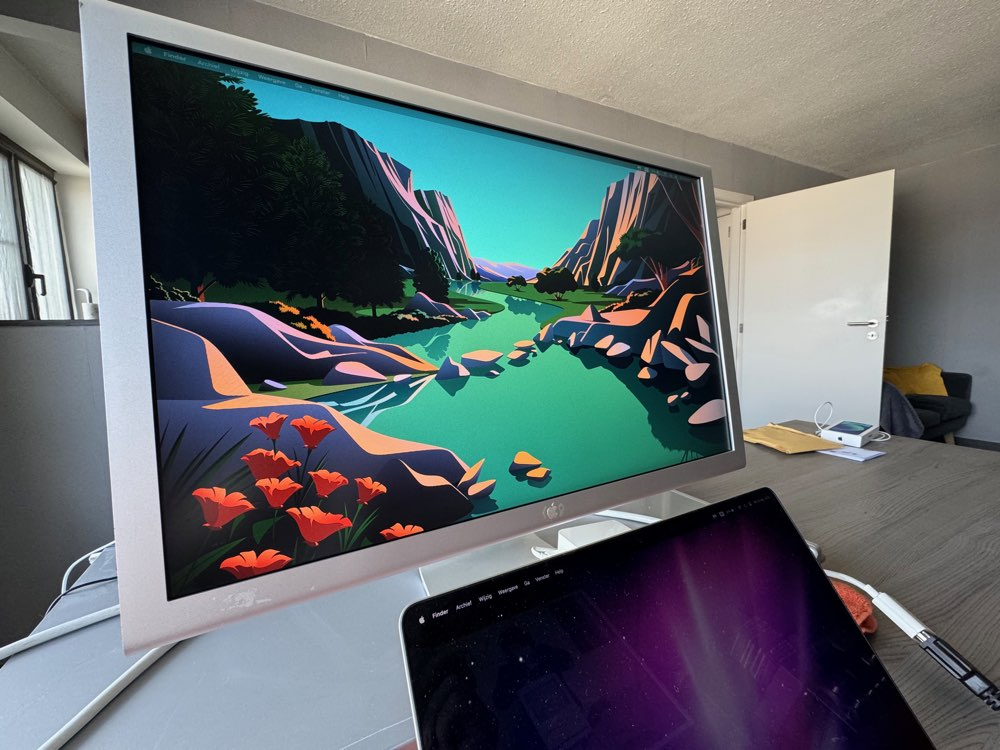
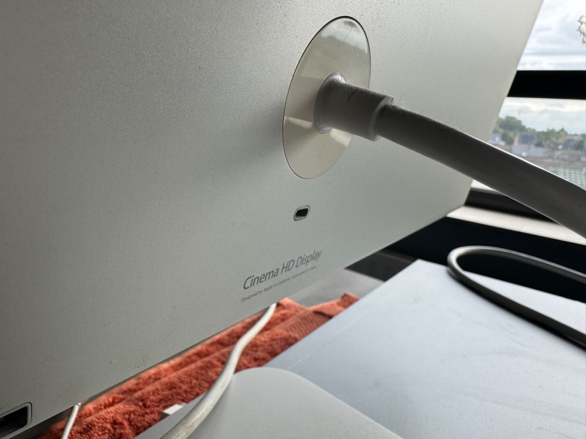

# Apple Cinema HD Display 23"

## Introduction

For my **web development** studies, I wanted a second screen for my **MacBook Pro 14" M1 Pro**. This would give me more screen space for creating **HTML/CSS** pages.

I already had a 27" **iiyama XB2779QS-S1** monitor, but it's a somewhat unattractive plastic device. It functions well as a monitor, but the design doesn't appeal to me.

So, I started looking into **Apple** monitors. My options were:

1. Cinema HD Display 23"
2. LED Display 24"
3. Thunderbolt Display 27"

I ruled out options 2 and 3 because they use **DisplayPort** or **Thunderbolt ports**. I wanted something that would also connect easily to computers with **DVI**. Although I may not need this frequently, it seemed convenient ;-)

The **Cinema HD Display 23"** was also more visually appealing to me than the other two. So, I decided to go with the **Cinema HD Display 23"**.

## The Search

The search was brief ;-) I quickly found a local seller who was offering the **Apple Cinema HD Display 23"**. So, I arranged to meet up and buy it.

While preparing to pick up the **monitor**, I read that there could be an issue with the **power supply** for this **monitor**. There were 65W and 90W versions available, and the 65W models often failed because the **monitor** needed more power. This was something I kept in mind, but I also saw that 90W versions were still available online. In the end, the 90W version came with the purchase, which was a lucky break.

The seller assured me that the **monitor** was working, and indeed, it was. I tend to trust people on their word ;-)

## Build Quality

)

One of the reasons I chose the **Cinema HD Display 23"** was its aluminum construction, making it very sturdy. It also has some weight to it, about 10 kg if I’m not mistaken. But how often do you need to lift your **monitor**, right? ;-)

The monitor can tilt, but it’s not height-adjustable, so I needed to find a solution for that. Eventually, I found a **monitor** stand that fits. The monitor needs to sit above the open screen of my **MacBook Pro 14" M1 Pro**, so it had to be about 5 to 7 cm higher than the **monitor** stand itself.

## Connections

This **monitor** uses a **DVI** connection and has two **USB-A 2** ports and two **FireWire 400** ports. Much has been written about the cable being too short, forcing it to sit on the desk. I didn’t want to settle for that, so I looked for and found a solution.

I bought a **DVI to USB-C** adapter, specifically [Logilink DVI to USB-C adapter](https://www.amazon.com.be/dp/B06XNJK99N?ref=ppx_yo2ov_dt_b_fed_asin_title). Then, I got a **USB-C** extension cable [Drivv USB-C Extension Cable](https://www.bol.com/be/nl/p/drivv-usb-c-3-2-male-naar-usb-c-female-kabel-fast-charge-snellader-usb-c-data-en-oplaadkabel-2-meter-o-a-samsung-iphone-15-meer-grijs/9300000176760754/?bltgh=f1119018-aba4-40be-bebf-3b334a7c1688.wishlist_details_page_products.WishlistDetailProductCardItem_2.ProductTitle).

And voila, problem solved—the **power brick** now sits on the floor, where it belongs.

## Display Quality

I’m very satisfied with the **display quality**. It’s a non-reflective screen with excellent colors. I know this isn’t 4K or even 5K, but honestly, I don’t need that with my poor eyesight ;-) The **monitor**’s resolution is 1920x1200 on a 23" diagonal. This is my ideal balance, as the **monitor** is not too large but still clear and easy to read for me.

## Total Cost

The **Apple Cinema HD Display 23"** itself cost me €50. The adapter was €23.43, and the extension cable was €14.99.

So, the total was €88.42, which is quite a bargain for a screen of this quality and vintage.

## Conclusion

For €88.42, I have a beautiful **monitor** with excellent image quality for my needs—and it's an **Apple** product ;-)
I tend to appreciate older **Apple** devices, which is why my network also runs on **Apple Extreme** units.

If you truly need 4K or 5K resolution or a higher **refresh rate**, this **monitor** isn't for you. But otherwise, I highly recommend it.