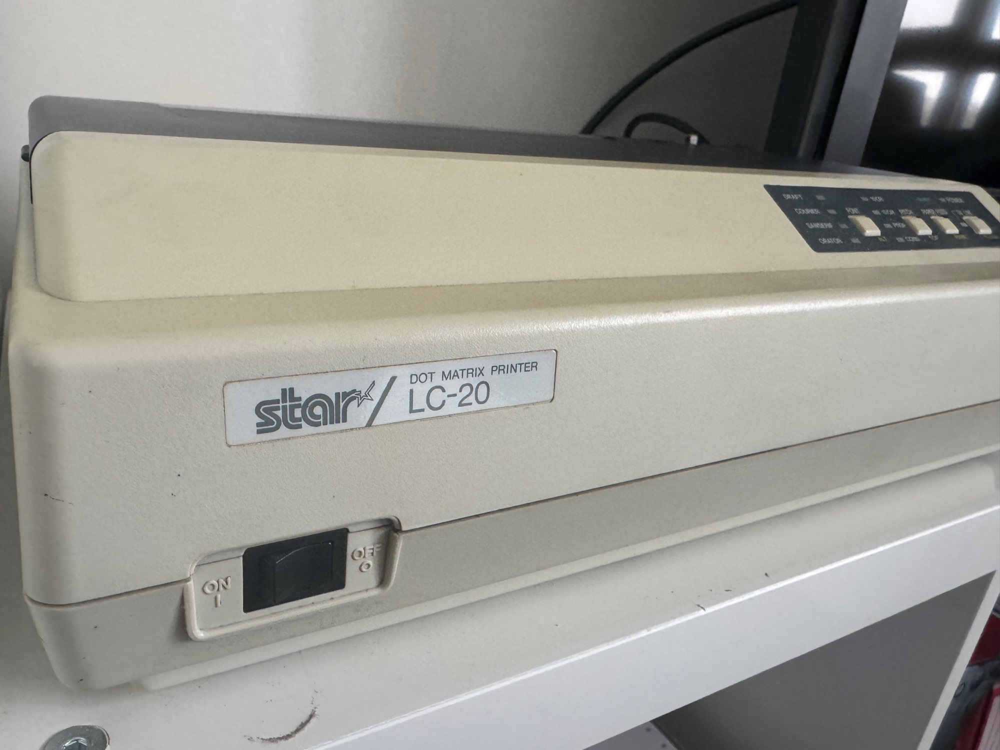
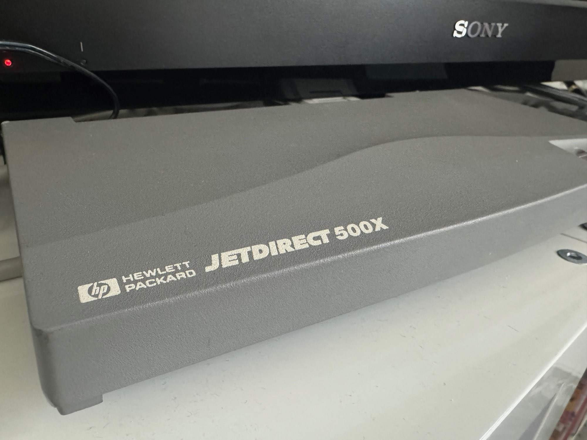
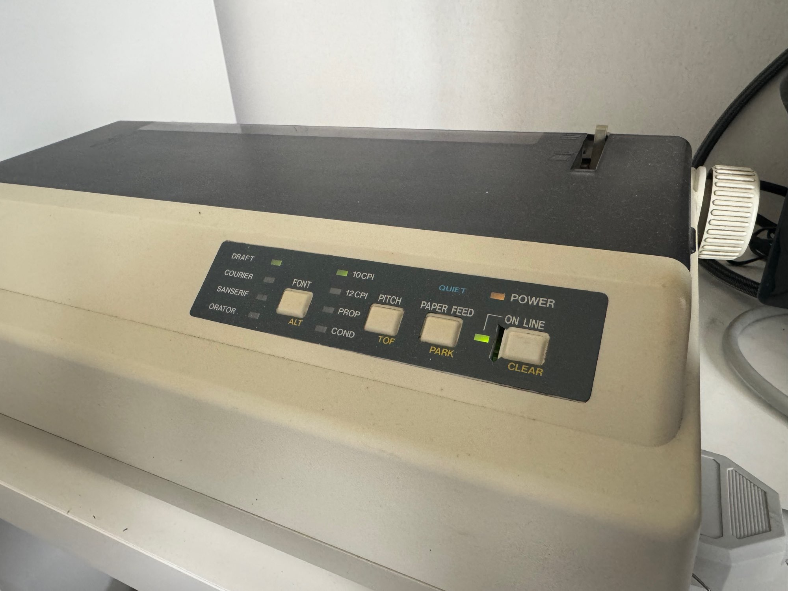
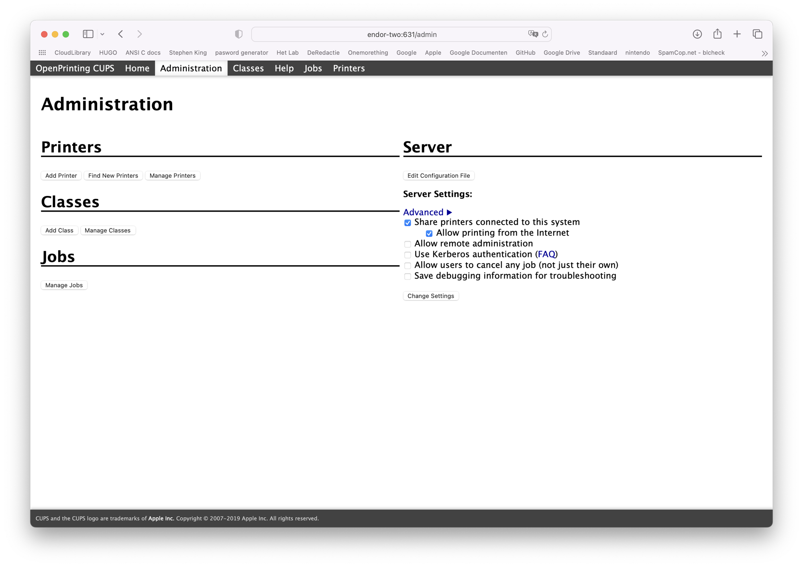
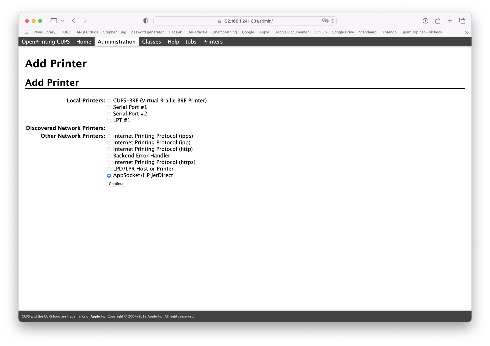
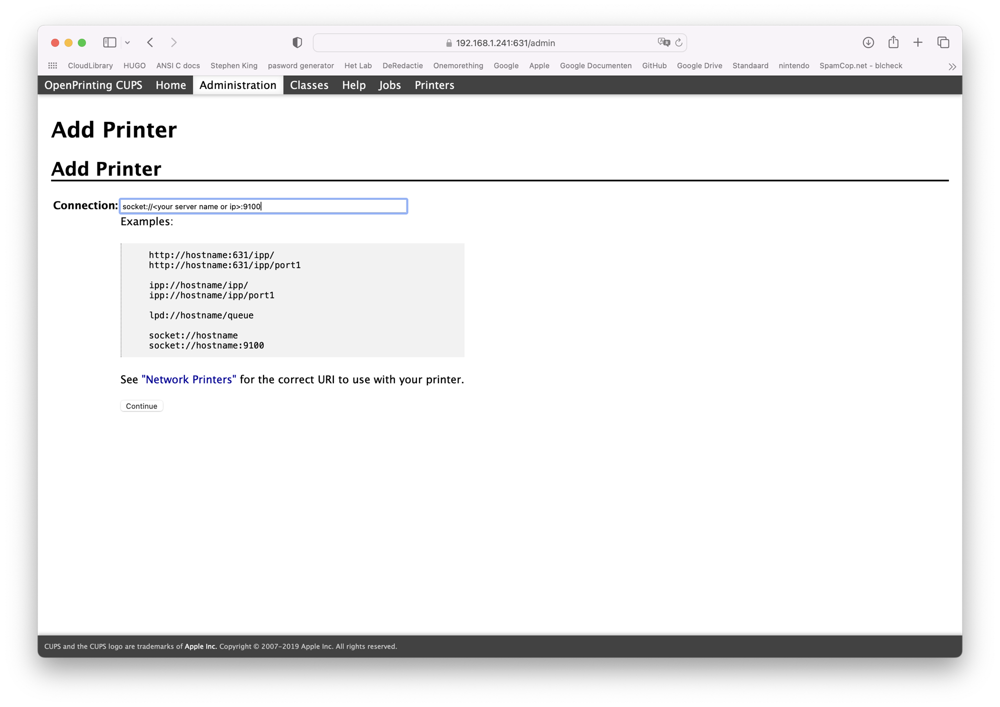
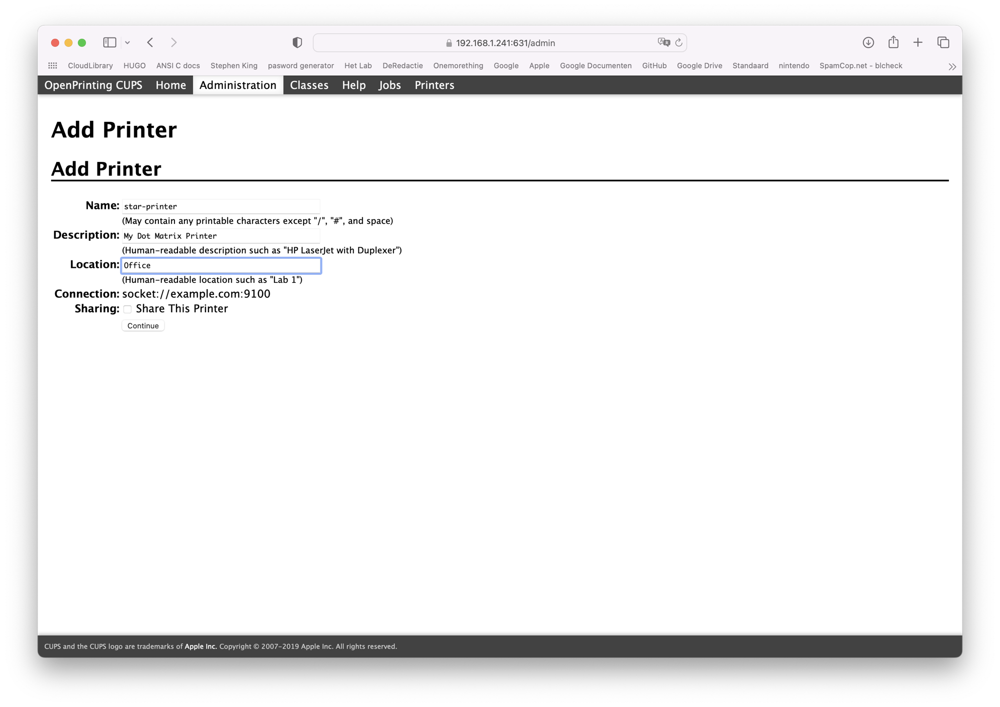
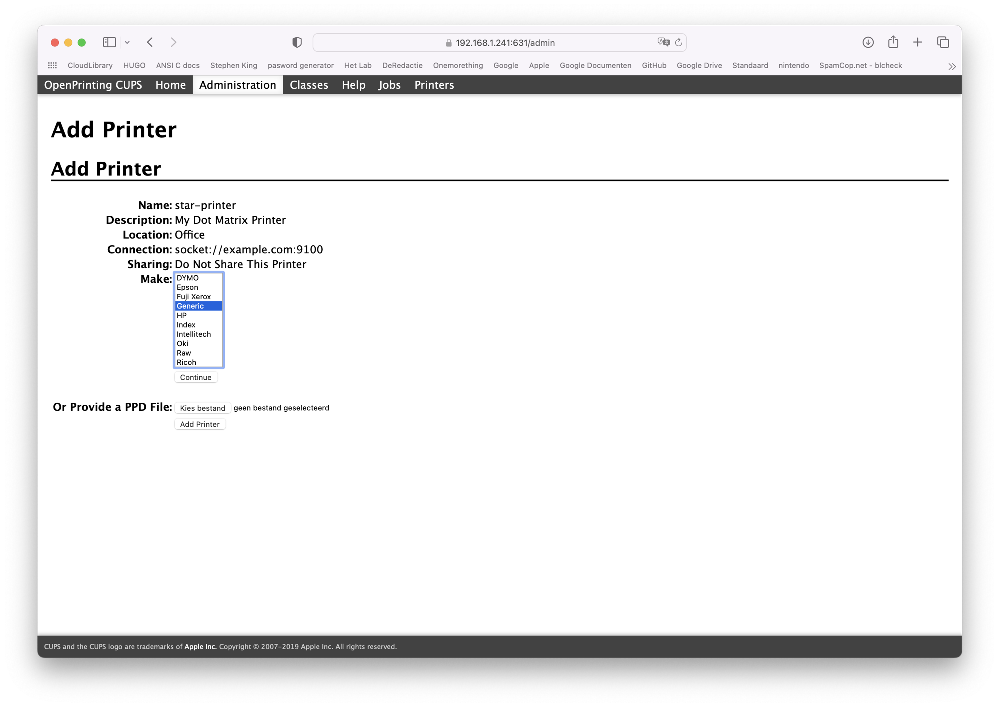
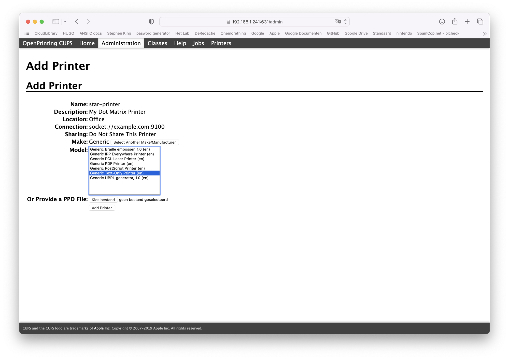

# Star LC-20 Dot Matrix Printer in 2024

## Preface

Somewhere in the 1980s I got **computer** lessons at my school, there they had **dot matrix printers** most of them were **Star** **printers**. Since then I always wanted a **Star dot matrix printer**, but with years passing by I had no use case scenario for it.

Now in 2024 I found a use case, I'm going to print **server status messages** to the **dot matrix printer** on **continious computer paper**.

So let's begin !!

## Buying components

First I searched for **dot matrix printers** when I stumble upon [Second Life Computers](https://www.2nd-life-computers.com), they have a big stock of used **dot matrix printers** from different brands.

I contacted them via e-mail and their response was to buy the **printer** through eBay, so I did just that.

At the same time I was looking for a **print server**, I was looking for a **HP JetDirect** because of [Veronica Explains](https://www.youtube.com/watch?v=3yVInvpebUk) youtube video about **dot matrix printers**. This was the video that gave me the idea to do it myself.

So **Second Life Computers** also had **print servers** and I decided to buy a **HP JetDirect 500x**.

With the two items on their way the waiting game began.

Over the span of two months I collected the other items needed to setup my **Star LC-20** and **HP JetDirect 500x**.

The next item was **inkt ribbon**. After a short search I landed on [amazon.com.be](https:amazon.com.be) for **inkt ribbon** There were 2 brands, the first being **Pelikan** and the second being **Peach**. I opted for **Peach**.

The next item on the list was a **printer cable**. After some research I needed a **parallel DB25 male to Centronics 36 male cable**. They are sold buy the masses, so I picked a cheap one.

After arrival of the **printer cable** I tried to connect it to the **printer** but the metal around the connector was too small for the connection on the **printer**. So I removed it and now it was connected. The trade off was that I need to be carefull when handling the **printer** so the cable doesn't disconnect, but that's not a problem.

 The next thing was a **PSU** for the **HP JetDirect 500x**. In the documentation I found the exact model I needed so that's my next order on eBay.
 
The last thing on my list was **continious printer paper**. Again found it at [Amazon.com.be](https://www.amazon.com.be/dp/B001PMZ8P4?psc=1&ref=ppx_yo2ov_dt_b_product_details).

Now everything was deliverd and it was time to setup my **Star LC-20 dot matrix printer**.

## Setup

This was fairly easy just connect the **printer** to the **HP JetDirect 500x print server** and connect the **print server** to my **Airport Extreme** for wireless access.

The next step was **printing** a test page, which I needed to collect the IP address of the **print server**.

Now it was time to setup **CUPS** on my **QNAP TS-251 NAS**. This **NAS** will be the gateway to the **printer**, every request for the **printer** will be send through my **NAS**.

## CUPS setup

First browse to the CUPS webpage (example: http://10.0.0.12:631/admin)

click on 'add printer'

Choose AppSocket/HP JetDirect

In the connection field enter URL (example: socket://10.0.0.13:9100) (9100 is the first port on the **HP JetDirect 500x print server**.

Now enter the name, description and location of the **printer**.

For make choose Generic

As model choose Generic Text-Only printer

Now click on 'add printer' and the setup is done.

It's time to test the **printer**. Type following on the **NAS** command line

	echo "Hello!!" | lp -d <name printer>
	
Now it should **print**.

## Total Costs

Everything is including shipping

- Star LC-20 137,55€ 
- HP JetDirect 500x 40€ 
- inkt ribbon Peach 10,65€
- DB25M -> CN36M cable 18,94€
- HP PSU 9100-5166 (power for **print server**) 14,89€

Total costs: 222,03€

I didn't include the paper because this will be pruchased once in a while.

## Conclusion

It wasn't very cheap but It was a lot of fun setting this **Star LC-20 dot matrix printer** and **HP JetDirect 500x print server**.

This whole journey took about three months because of securing funding for the project.

The **dot matrix printer** still have a life in 2024, although it's a niche life ;-)