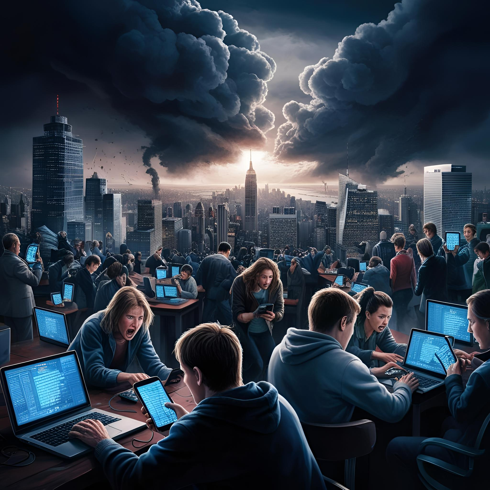

Sure! Here’s the translated text:

# Preparing for Internet Outage

## Scenario

Imagine one morning you want to open your **bank app** to check if your salary has been deposited, but the app won’t open and shows an **error**.

Well, it can happen that the **bank app** is temporarily **offline**. So, let’s check the **news** to see what happened overnight. That won't load either.

Then let’s see if there are any **outages**, and that doesn’t work either.

Apparently, there’s a **problem** with the **internet**, and almost everything we do daily relies on the **internet**.

There may be an issue with the **provider** or, worse, with the **cables** on the ocean floor. If the **internet** goes down for an hour or so, that’s not a problem; there are still things you can do **offline**, like doing the dishes or playing board games ;-).

But what if the **problems** last for days or longer?

To continue with **programming** and my **entertainment**, I’ve taken steps to be able to carry on.

How? I’ll explain that here in this blog.

## Programming

For **programming**, I have three domains to choose from.

1. HTML/CSS
2. Perl
3. ANSI C

For each of these languages, I need to regularly refer to **documentation** on the following sites:

- W3Schools
- Perl.org
- GNU.org

So, I’ve **downloaded** a large part of these websites (the parts I need) using **SiteSucker**, an app that allows you to download websites.

For example, for **ANSI C**, I have downloaded the **language manual** and the **docs** for the **standard libraries**.

For **HTML/CSS**, I have partially **downloaded** the relevant websites—just enough to access those docs.

For **Perl**, I can make every module created available since the day I downloaded the site, even if the **internet** goes **down**.

Additionally, I’ve ensured I can view **Wikipedia articles** on **sorting** and **search algorithms**, as well as **data types**.

I’ve also downloaded relevant pages on **mathematics** from [Geeks For Geeks](https://www.geeksforgeeks.org).

All in all, this doesn’t take up too much hard drive space, so you can easily store it at home on a computer, or better yet, on a couple of hard drives ;-)

So, if the **internet** goes **down** for an extended period, I can still continue **programming** and looking things up. Of course, I won’t have everything covered, but most of it is indeed available offline for me.

## YouTube

What I do for **relaxation** is watch **YouTube** about various topics, especially **technology**. I’ve made backups of certain content. This does take up some space on a hard drive, but currently, I have not downloaded more than 2TB of **YouTube** content.

This includes **vlogs** from a YouTuber I follow; some are 2 hours long, and he posts twice a week. I have all his vlogs from 2015 to 2025, and I’m currently downloading those from 2014.

I also have various **tutorials** and other **computer content** that provide me with **relaxation** or **education** stored on a hard drive.

So, I can just watch videos for a long time.

## Music

Years ago, I canceled my **Spotify** and **Apple Music** subscriptions and started buying physical **CDs** and **LPs** again. I mainly buy physical for the quality, but an added benefit is that I can listen to music when there’s no **internet**.

## Movies and TV Series

I also have a nice collection of physical **DVDs** and **Blu-Rays** of **movies** and **TV series**. I do this because movies and series can just disappear from streaming services, so I buy the ones I really enjoy and watch occasionally.

On [my website](https://www.debrul.be/collections), you can find my collections of **movies** and **series**, as well as collections of books and music.

In fact, I don’t have any subscriptions to TV streaming services anymore. Everything I watch is either **YouTube** or my physical **DVDs** and **Blu-Rays**. In the meantime, I have two plastic bins of 65L each that are nearly full.

I **rip** the **DVDs** and **Blu-Rays** and store them on my **servers**, so I don’t have to put a physical disc in my player every time. I just open **Infuse** on the **Apple TV**, and that’s it.

I don’t **rip** **4K Blu-Rays**; I still watch those via my **Xbox One S**.

## Lastly, Books

Three years ago, I started reading **books** on an **e-reader**, simply because I can read in the evenings. Due to my poor eyesight, I have difficulty reading a **book** as it starts to get dark.

I buy my **books** from [Standaardboekhandel](https://www.standaardboekhandel.be), specifically those I can’t find in the online **library** and those I really want to reread. For example, I buy **books** by **Stephen King** and also **non-fiction**. Check out [my website](https://www.debrul.be/collections).

I download them after purchasing and keep a copy on my **e-reader** and one on my **backup server**.

## Conclusion

You can see that if the **internet** goes **down** for any reason for an extended period, I still have my **entertainment** and can continue **programming**.

I hope this will never be necessary, but most people have **insurance** for when something goes wrong. I view my **offline** available **content** as a sort of **insurance**.