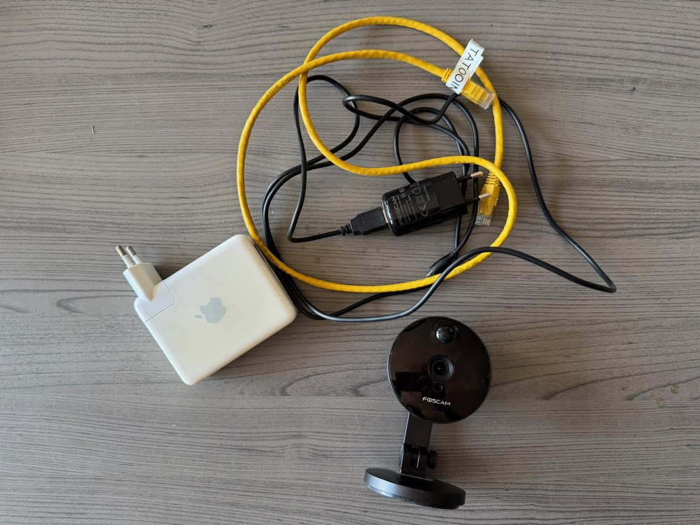
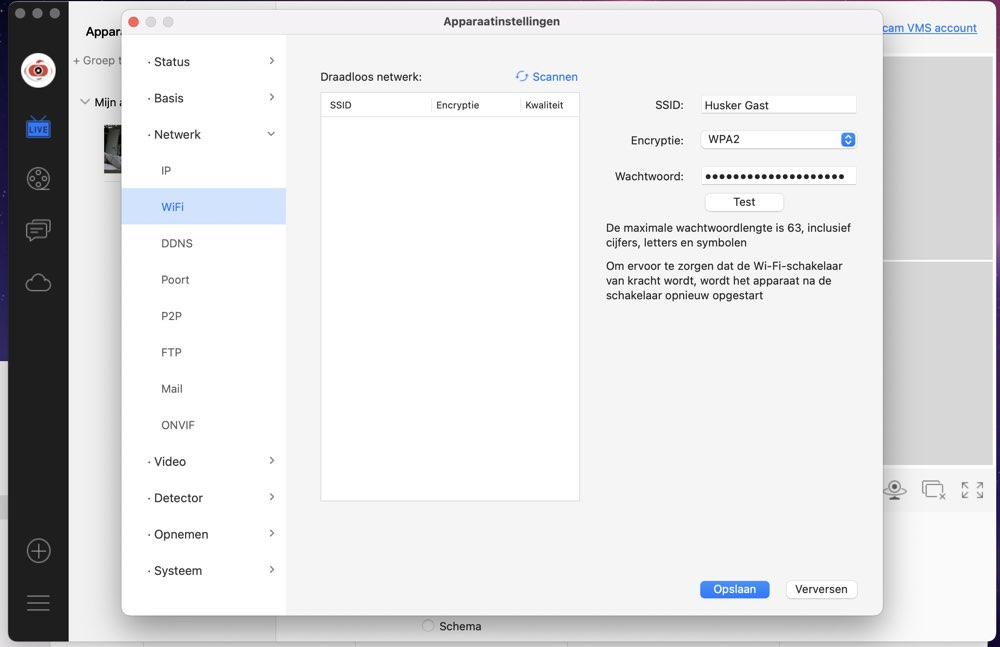

# Foscam C1 Setup

## Intro

Years ago, I bought a **Foscam C1 camera** to keep an eye on things. I chose this model because it can record to an **SD card**.

One night, I heard laughter coming **from the Foscam C1 camera**. I immediately unplugged the **camera** and never used it again.

It turned out that **Foscam** was full of security holes. Despite using a strong password, others were still able to watch.

Now, years later, I want to use the **camera** again, but I’ve learned from last time.
This time, the **camera** will not be connected to the internet.

## Materials

Since I still want to be able to view the camera feed and download recorded videos, the **MacBook** and the **Foscam C1 camera** need to communicate with each other somehow.

That’s where another old device comes in. I still have an **Airport Express Gen1**, and I can configure it to create its own network separate from the internet. This way, it will never communicate with the outside world.

I can then connect the **Foscam C1 camera** to the **Airport Express** via WiFi, and also connect the **MacBook** via WiFi when needed to configure the **camera** and perform any necessary setup.

All of this, without the **camera** ever being connected to the internet.

## Setting up the Airport Express

First, I reset the **Airport Express** to factory settings and plugged it in.

Then I started the **Airport Utility** and selected the **Airport Express** in the “new devices” section.

After that, I simply let it create a new WiFi network. Once the setup was complete, I had a new WiFi network that was completely separate and not connected to the internet.

You can now log in to the **Airport Express** by selecting and connecting to the newly created WiFi network.

You can also manage the **Airport Express** further using the **Airport Utility**.

The **Airport Express** will now always blink amber, this means it’s active but not connected to the internet.

## Setting up the Foscam C1

I also reset the **camera** to factory settings and initially connected it to my existing **network switch**.
This was necessary because you need to connect the camera to the new WiFi network via **Foscam VMS**, but you first have to be able to access its settings.

At first, I connected the **Foscam C1 camera** to the **Airport Express** via **Ethernet**, thinking I could configure it that way to connect to the **Airport Express WiFi network**. But that didn’t work.

So, I temporarily connected the **camera** via **Ethernet** to my **network switch** instead, so that I could configure it to use WiFi.

When you select your **SSID** and enter the password, it’s important **not** to click the “Test” button, it always gave me an error.
Just click **Save**, and it will work fine.

After that, I could disconnect the **Foscam C1 camera** from the network and place it in the bedroom.

The rest of the setup was done over the **Airport Express** WiFi network.

Now everything works, and it can no longer be hacked, unless someone is on my home network ;-)

## Conclusion

Whenever I want to view the footage or change settings, I simply connect to the **Airport Express** WiFi network and do whatever I need.

That’s how I managed to safely put my **Foscam C1 camera** back into use.
I don’t need to access my **camera** remotely. If I want to check or adjust something, I’m home anyway.

