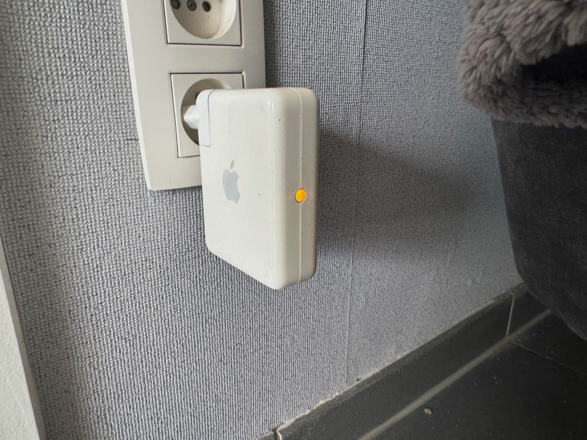

# Foscam C1 Setup

## Intro

Jaren geleden heb ik een **Foscam C1 camera** gekocht om het één en ander in de gaten te houden. Ik heb dit model gekozen omdat je kunt opnemen naar **SD-kaart**.

Op een nacht hoor ik gelach komen uit de **Foscam C1 camera**, ik heb toen direct de **camera** van de stroom gehaald en niet meer gebruikt.

Bleek dat **Foscam** zo lek is als wat, ondanks het gebruik van een sterk wachtwoord konden anderen dus gewoon meekijken.

Nu jaren later wil ik de **camera** terug in gebruik nemen, maar ik heb geleerd van vorige keer.
Deze keer wordt de **camera** niet aan het internet gehangen.

## Materiaal

Omdat ik de camera wel wil kunnen bekijken en de opgenomen video's wil kunnen downloaden moet de **macbook** en de **Foscam C1 camera** op één of andere manier wel met elkaar kunnen communiceren.

Hier komt een ander oud apparaat kijken. Ik heb nog een **Airport Express gen1** liggen en deze kan ik zelf een netwerk laten maken los van het internet. Deze zal dus nooit met de buitenwereld communiceren.

De **Foscam C1 camera** kan ik dan via WiFi verbinden met de **Airport Express** en de **macbook** kan ik dan ook indien nodig aansluiten via WiFi en zo de **camera** instellen en al hetgeen er moet gebeuren.

En dat alles zonder dat de **camera** op het internet is aangesloten.

## Setup Airport Express

Eerst heb ik de **Airport Express** gereset naar fabrieksinstellingen, daarna in het stopcontact.

Daarna **Airport Configuratie programma** gestart en dan de **Airport Express** selecteren in de "nieuwe apparaten" sectie.

Dan was het gewoon een eigen wifi netwerk laten aanmaken en nadat de setup zijn gang heeft gegaan heb je een nieuw WiFi netwerk los van de bestaande, en niet aangesloten op het internet.

Je kan nu inloggen op de **Airport Express** door het aangemaakt WiFi netwerk te kiezen en ermee te verbinden.

Nu kan je via **Airport Configuratie programma** ook de **Airport Express** verder beheren.

De **Airport Express** zal nu altijd amber gekleurd blinken, dit is omdat hij actief is maar niet verbonden met het internet.

## Setup Foscam C1

Deze heb ik ook gereset naar fabrieksinstellingen en in eerste instantie verbonden met mijn bestaande **netwerk switch**.
Dit was nodig omdat je dan de foscam kan verbinden met het nieuwe WiFi netwerk via **Foscam VMS**, maar je moet er dus in eerste instantie in de settings kunnen komen.

In het begin had ik de **Foscam C1 camera** via **ethernet** verbonden met de **Airport Express** omdat ik dacht dat ik zo de **camera** kon instellen om te verbinden met het WiFi netwerk van de **Airport Express**. Maar dit werkte niet.

Dan heb ik de **camera** dus via **ethernet** tijdelijk aangesloten op mijn **netwerk switch** zodat ik de **camera** met WiFi kon verbinden.

Als je je **SSID** kiest en het paswoord invult is het belangrijk dat je niet op de test button klikt, dit geeft bij mij altijd een foutmelding.
Je moet gewoon op opslaan klikken en dan is het in orde.

Nu kon ik de **Foscam C1 camera** van het netwerk halen en in de slaapkamer plaatsen.

De verder setup heb ik dan via het **Airport Express** WiFi netwerk gedaan.

Nu werkt alles en kan hij niet meer gehacked worden tenzij er iemand op mijn netwerk thuis zit ;-)

## Slot

Elke keer dat ik de camerabeelden wil bekijken of instellingen wil aanpassen log ik in op het **Airport Express** WiFi netwerk en kan ik doen wat ik wil.

Zo heb ik mijn **Foscam C1 camera** weer in gebruik kunnen nemen op een veilige manier. Voor mij hoeft het niet dat ik van buitenaf mijn **camera** kan bekijken, als ik iets wil zien of veranderen ben ik gewoon thuis.
