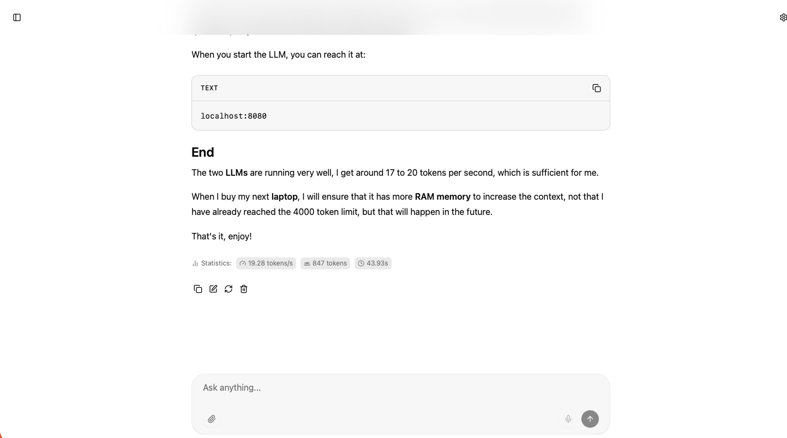

# Llama.cpp and LLM Installation

## Beginning

As I work more with AI, I want to be able to use it locally without an internet connection. Initially, I planned to buy a new **server** and install Llama.cpp on it.

During my research, I found that the new **Apple M1** chips are perfect for running Llama.cpp, and since I own a **MacBook Pro M1 pro 16GB**, I looked into it further. With **16GB of RAM**, I can run a lightweight **LLM**.

There is one **LLM** specifically designed for programming and another for **chatGPT**-like tasks, such as general non-coding questions.

You may need to install **xcode-commandline-tools** first, which was already installed on my system.

In this article, I will explain how I installed Llama.cpp, so enjoy reading.

## Installing Homebrew and CMake

First, we will ensure that Homebrew is installed on the system, which is necessary for the CMake command.

    /bin/bash -c "$(curl -fsSL https://raw.githubusercontent.com/Homebrew/install/HEAD/install.sh)"

Run this command in the terminal. After installation, you will need to execute a few more commands provided by the installer.

Then, we will install CMake using the following command:

    $ brew install cmake

Let it do its work, and once it's installed, you're good to go.

## Installing Llama.cpp from Source

Go to a folder where you want to install Llama.cpp, I chose a 'llamacpp' folder in my home directory. Now, we will clone Llama.cpp from GitHub:

    git clone https://github.com/ggml-org/llama.cpp
    cd llama.cpp

Next, we will compile Llama.cpp using the following commands:

    $ cmake -B build
    $ cmake --build build --config Release -j 8

Once this is done, you have successfully installed Llama.cpp on your MacBook Pro.

## Downloading and Installing LLMs

The next step is to download and run LLMs. I have chosen two:

    bartowski/Meta-Llama-3-8B-Instruct-GGUF:Q4_K_M
    bartowski/Qwen2.5-Coder-14B-GGUF:Q4_K_M

The first is a general-purpose LLM like chatGPT, and the second is specifically designed for programming.

Now, we will download and start these LLMs for the first time.

Go to the folder you chose to clone Llama.cpp:

    $ ~/llamacpp/llama.cpp/build/bin

Now, execute the command that you used to download (only the first time) and start the LLM. This may take a while. Once the download is complete and the Llama.cpp server is started, you can stop it by pressing Ctrl+C in the terminal.

    ~/llamacpp/llama.cpp/build/bin$ ./llama-run -hf bartowski/Meta-Llama-3-8B-Instruct-GGUF:Q4_K_M
    ~/llamacpp/llama.cpp/build/bin$ ./llama-run -hf bartowski/Qwen2.5-Coder-14B-GGUF:Q4_K_M

Now, both LLMs are downloaded and installed, and from now on, you won't need the internet to ask questions, only when the AI needs to search the internet.

When you start the LLM, you can reach it at:

    localhost:8080

This screenshot is done on a local running **LLM** **bartwoski/Meta_Llama-3-8B-instruct** and the result is the translation from dutch to english of this blogpost.

## End

The two **LLMs** are running very well, I get around 17 to 20 tokens per second, which is sufficient for me.

When I buy my next **laptop**, I will ensure that it has more **RAM memory** to increase the context, not that I have already reached the 4000 token limit, but that will happen in the future.

That's it, enjoy!