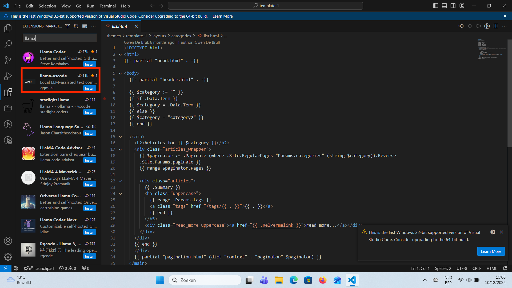
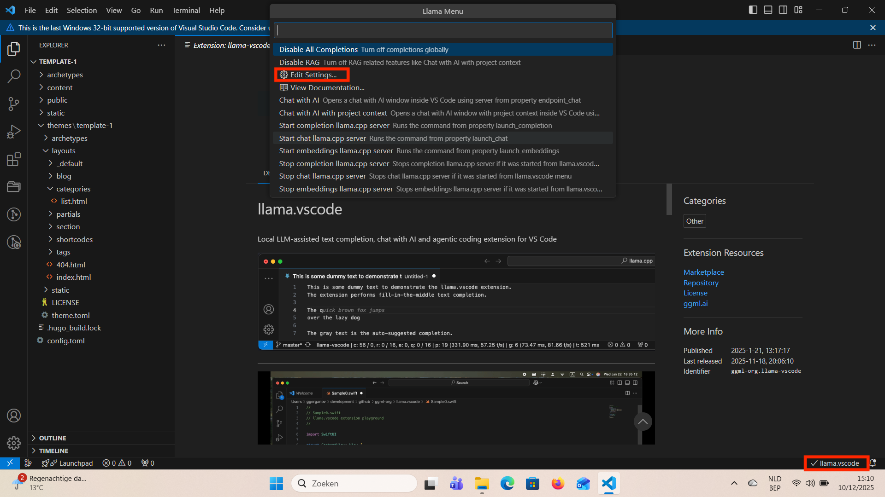
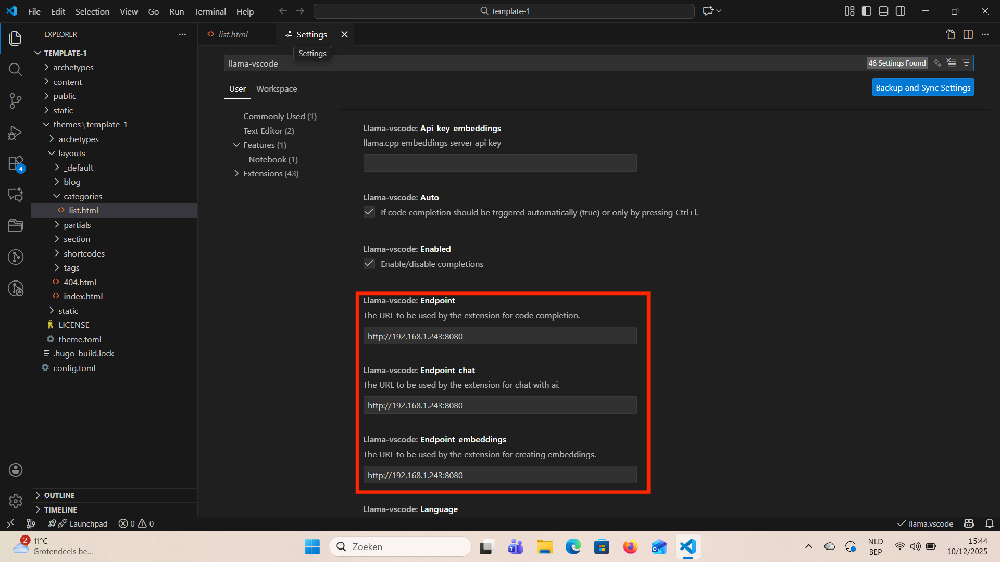
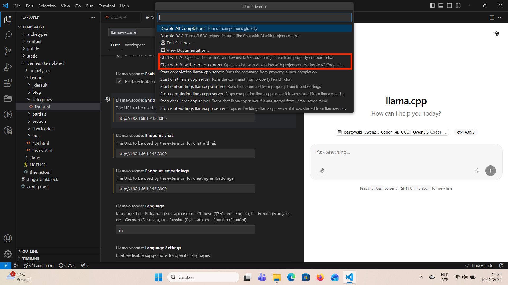

# Configureer Llama.cpp in VS Code

Als je om één of andere reden niet de browser wilt gebruiken voor je LLMs, dan kun je deze bereiken vanuit Visual Studio Code. Hier leg ik uit hoe het moet. Dit is een eenvoudig proces.

## Vereisten

Je moet al een werkende Llama.cpp hebben op een computer. Het maakt niet uit of dit je werk computer is of ergens anders op een externe computer. We gaan werken met endpoints. Je moet Llama.cpp dus ook kunnen bereiken via een andere computer, hiervoor moet je de volgende parameter meegeven wanneer je Llama.cpp server start.

    --host 0.0.0.0

Voorts moet je al VS Code hebben geinstalleerd op je computer.

## Stap 1 installeer de llama-vscode extensie

Start je VS Code app en zoek naar de extensie "llama-vscode"

## Stap 2 Edit settings

Nu gaan we de endpoints instellen. Als je ""llama-vscode" geinstalleerd hebt dan staat er onder aan llama.vscode. Als je daar op klikt kun je kiezen voor de "edit settings", er opent nu een bestand waar je de endpoints gaat invullen.

In het bestand dat geopend is scroll je naar beneden tot je "Llama-vscode endpoints" ziet staan. Wat je minimaal moet doen is de endpoint voor chat invullen met het adres waar je je Llama.cpp kunt bereiken in de browser. Bij mij is dat "HTTP://192.168.1.243:8080"

## Stap 3 Open Chat

Nu dat je de endpoints hebt ingevuld gaan we een chat venster openen in VS Code zelf.
Dit kun je doen op macos door CTRL+; te typen in een openstaand bestand. Op windwos klik je weer op llama.vscode onderaan in VS Code en klik je op "Chat with AI" of "Chat with AI with project context".

## Conclusie

Nu zou de chat functie moeten werken. Je moet altijd wel op de computer waarop je Llama.cpp server draait zorgen dat de server effectief draait. Voor de rest kun je nu in VS Code vragen stellen aan je AI zonder VS Code te moeten verlaten.