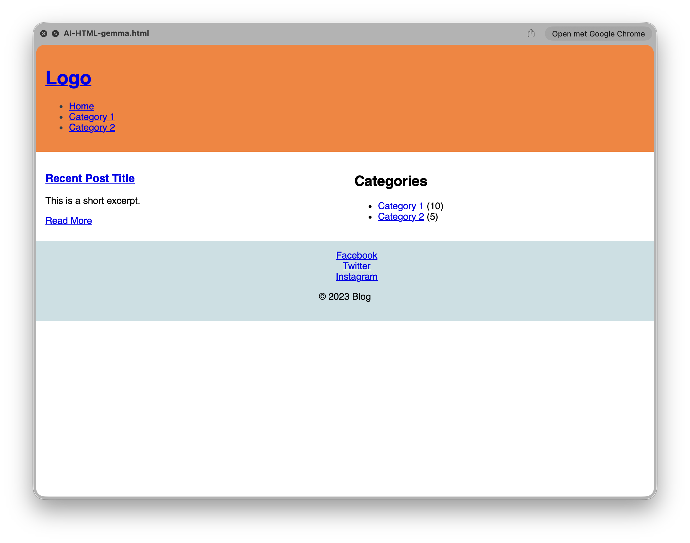
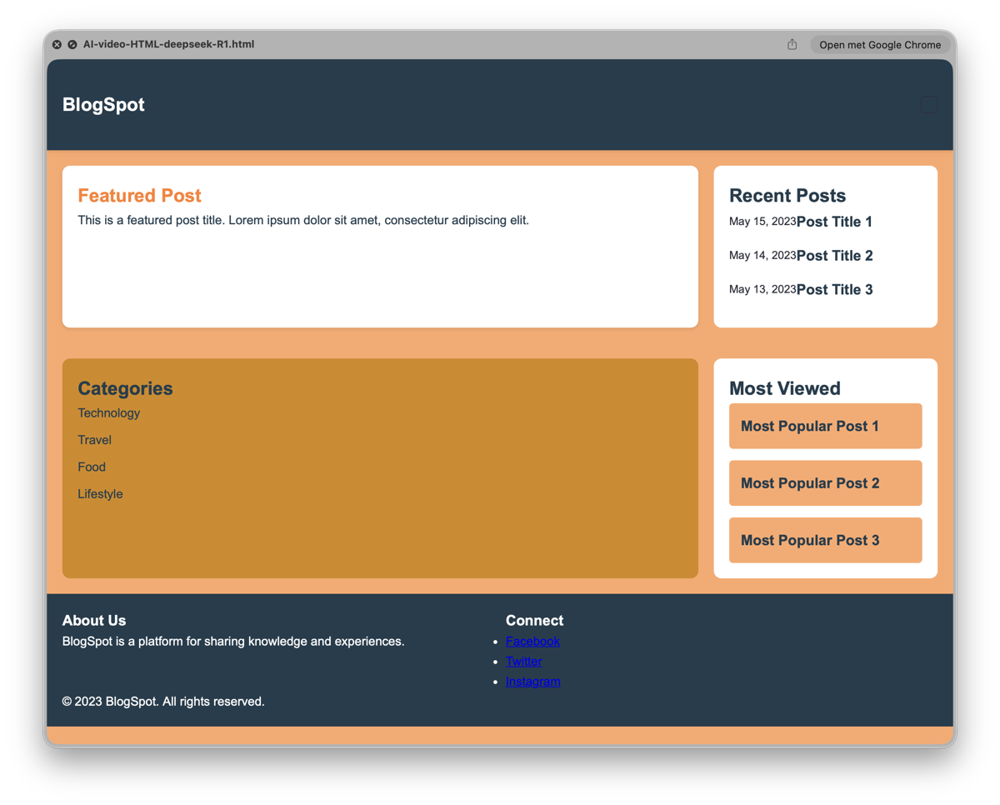

# Hoe ik LLMs gebruik voor webdesign en coding

## Disclaimer

De **AI prompts** die ik hier gebruik zijn zeer eenvoudig en enkel bedoeld om te laten zien wat je krijgt met het gebruik van eenvoudige **AI prompts**. In het kort, hoe specifieker je **AI prompt** hoe beter je resultaat gaat zijn.

Voor de **coding prompts** heb ik bij een bepaald LLM de **prompt** moeten aanpassen, omdat dit niet werkte en een **context full** error gaf.

## Mijn gebruik

Ik gebruik **LLMs** eigenlijk als toevoeging op de gewone **documentatie** als het gaat om **coding** vragen. Als ik bijvoorbeeld moet weten hoe een **specificatie** van een functie eruit ziet. Ook als ik niet goed weet welke functie ik moet gebruiken kan ik dit snel opzoeken via **LLMs**.

Als ik een **probleem** moet aanpakken maar ik weet niet goed hoe dan vraag ik een **stappenplan**. Ik vermijd het vragen van regelrechte **code**, omdat de fun in het **programmeren** bij mij zit in het oplossen van **problemen** en dit omzetten naar **programmacode**.

Wat ik wel doe in mijn **IDE** is **code aanvullen**, dit besparrt tijd en als ik een functie niet zo goed vanbuiten ken ook **opzoekwerk**.

In dit artikel gebruik ik 4 **LLMs** voor **code** gerelateerde vragen en **generieke** vragen (voor HTML/CSS).

## LLM used for C# docs lookup

4 prompts

##### C# method lookup

1. Show all methods for comparing two strings
2. Show spec of compare method you gave in the previous answer

##### C# spec and properties lookup

B1. Give me the spec for FileObject.Copy(destination[,overwrite]) in .NET

B2. Give me all properties for a File Object

## bartowski/Qwen2.5-Coder-14B-GGUF:Q4_K_M

#### 1. PROMPT: "Show all methods for comparing two strings"

Dit is een eenvoudige prompt die per **LLM** verschillende output heeft. Hier met dit **LLM** kom je er mee weg om niet specifiek te zijn in je vraagstelling. Kijk maar eens bij het **Deepseek-coder** model wat een betere prompt zou zijn.

Hier is het resultaat voor deze **prompt** nog goed. Het is goed dat er niet alleen droge uitleg staat maar ook een voorbeeld.

#### 1. ANSWER

Certainly! There are several methods in C# for comparing two strings. Here are some commonly used ones:

1. `Equals` method: This method compares two strings for equality. It returns `true` if the strings are equal and `false` otherwise.
   
   ```csharp
   string str1 = "Hello";
   string str2 = "hello";
   
   bool result = str1.Equals(str2); // returns false (case-sensitive)
   bool result2 = str1.Equals(str2, StringComparison.OrdinalIgnoreCase); // returns true (case-insensitive)
   ```

2. `Compare` method: This method compares two strings and returns an integer that indicates their relative sort order.
  	
  	```csharp
   string str1 = "Apple";
   string str2 = "Banana";
   
   int result = string.Compare(str1, str2); // returns a negative value (-1) because "Apple" comes before "Banana" in alphabetical order
   int result2 = string.Compare(str2, str1, StringComparison.OrdinalIgnoreCase); // returns a positive value (1) because "Banana" comes after "Apple" in case-insensitive alphabetical order
   ```

3. `CompareOrdinal` method: This method compares two strings using ordinal (binary) comparison and returns an integer that indicates their relative sort order.
   
   ```csharp
   string str1 = "Apple";
   string str2 = "Banana";
   
   int result = string.CompareOrdinal(str1, str2); // returns a negative value (-1) because the binary value of "Apple" comes before that of "Banana"
   ```

4. `CompareTo` method: This method compares the current string with another string and returns an integer that indicates their relative sort order.
   
   ```csharp
   string str1 = "Apple";
   string str2 = "Banana";
   
   int result = str1.CompareTo(str2); // returns a negative value (-1) because "Apple" comes before "Banana" in alphabetical order
   ```

These are just a few examples of the methods available for comparing two strings in C#.
	
#### 2. PROMPT: "Show spec of compare method you gave in the previous answer"

Het resultaat van deze prompt spreekt me ook aan omdat de uitleg goed is, verschillende return waardes, en er weer een voorbeeld bij zit.

#### 2. ANSWER

Certainly! Here's the specification for the `Compare` method in C#:

**`static int Compare(string strA, string strB)`**

**Parameters:**

- `strA`: The first string to compare.
- `strB`: The second string to compare.

**Return Value:**

- If `strA` is less than `strB`, the method returns a negative integer.
- If `strA` is equal to `strB`, the method returns zero.
- If `strA` is greater than `strB`, the method returns a positive integer.

The `Compare` method performs a culture-sensitive comparison of the two strings. It uses the current culture's sorting rules, which can affect the order of certain characters (e.g., diacritics or special characters).

**Example Usage:**

```csharp
string str1 = "Apple";
string str2 = "Banana";

int result = string.Compare(str1, str2); // returns -1 (case-sensitive)
int result2 = string.Compare(str2, str1, StringComparison.OrdinalIgnoreCase); // returns 1 (case-insensitive)
```

In this example, `str1` is compared to `str2`, and the method returns `-1` because `str1` comes before `str2` in alphabetical order. The second comparison is case-insensitive, so `str2` comes after `str1`, resulting in a positive value.

Note: The `StringComparison` enumeration is used to specify the type of string comparison to perform. In this example, `StringComparison.OrdinalIgnoreCase` performs a case-insensitive comparison.

#### B1. PROMPT: "Give me the spec for FileObject.Copy(destination[,overwrite]) in .NET"


Met deze **prompt** moest ik weer specifieker zijn. Merk op dat de voorbeelden niet kloppen met de functie specificatie, daar is **geen** spraken van een **source parameter**. Deze functiespecificatie is voor de **ASP** versie.

Dit kan er ook ingekropen zijn doordat ik niet duidelijk was dat ik de **ASP** versie bedoelde. De functiespecificatie was dus voor een **ASP** functie en de voorbeelden zijn voor de **.NET** versie.

Dit laat weer maar eens zien dat je echt wel specifieker moet zijn in je **AI prompts**. een toevoeging in de **prompt** met "ASP.NET" in plaats van ".NET" zou dit moeten opgelost hebben.

Voor de rest heb ik niets te klagen, de uitleg is duidelijk, enkel de voorbeelden kloppen niet.

#### B1. ANSWER

Certainly! In .NET, the `FileObject.Copy` method is used to copy a file from one location to another. Here's the specification for the method:

**`void Copy(string destination[, bool overwrite])`**

**Parameters:**

- `destination`: The path to the destination file or directory where the file should be copied.
- `overwrite` (optional): A boolean value indicating whether to overwrite the destination file if it already exists. If this parameter is not specified, the default value is `false`.

**Description:**

The `FileObject.Copy` method copies the current file to the specified destination path. If the destination file already exists and the `overwrite` parameter is set to `true`, the method will overwrite the existing file. If `overwrite` is set to `false`, the method will throw a `IOException` if the destination file already exists.

**Example Usage:**

```csharp
// Copy a file to a new location
File.Copy("source.txt", "destination.txt");

// Copy a file to a new location and overwrite the destination file if it already exists
File.Copy("source.txt", "destination.txt", true);

// Copy a file to a new location and do not overwrite the destination file if it already exists
File.Copy("source.txt", "destination.txt", false);
```

In the above examples, `File.Copy` is used to copy the file `source.txt` to the specified `destination.txt` file. The `overwrite` parameter is optional and can be used to control whether the destination file should be overwritten if it already exists. If `overwrite` is not specified, the default value of `false` is used, meaning the method will throw a `IOException` if the destination file already exists.
	
#### B2. PROMPT "Give me all properties for a File Object"

Met deze **prompt** is niets mis. Het geeft duidelijk de **.NET** versie en niet de **ASP.NET** versie. Dus hier kan je ook wat duidleijker zijn in je **prompt**. Maar op zich onthoudt De **LLM** dat ik vragen zijn stel over **.NET**.

#### B2. ANSWER

In .NET, the `System.IO.FileInfo` class represents a file object and provides various properties to access information about the file. Here are some of the commonly used properties:

1. `Attributes`: Gets or sets the file attributes.
   
   ```csharp
   FileInfo file = new FileInfo("file.txt");
   FileAttributes attributes = file.Attributes; // Gets the attributes
   file.Attributes = attributes | FileAttributes.ReadOnly; // Sets the attributes
   ```

2. `CreationTime`: Gets or sets the creation time of the file.
   
   ```csharp
   FileInfo file = new FileInfo("file.txt");
   DateTime creationTime = file.CreationTime; // Gets the creation time
   file.CreationTime = DateTime.Now; // Sets the creation time
   ```

3. `DirectoryName`: Gets the directory name of the file.
   
   ```csharp
   FileInfo file = new FileInfo("C:/path/to/file.txt");
   string directoryName = file.DirectoryName; // Returns "C:/path/to"
   ```

4. `Exists`: Determines whether the file exists.
   
   ```csharp
   FileInfo file = new FileInfo("file.txt");
   bool exists = file.Exists; // Returns true if the file exists, false otherwise
   ```

5. `Extension`: Gets the extension of the file.
   
   ```csharp
   FileInfo file = new FileInfo("file.txt");
   string extension = file.Extension; // Returns ".txt"
   ```

6. `FullName`: Gets the full path of the file.
   
   ```csharp
   FileInfo file = new FileInfo("file.txt");
   string fullPath = file.FullName; // Returns the full path of the file
   ```

7. `Length`: Gets the size of the file in bytes.
   
   ```csharp
   FileInfo file = new FileInfo("file.txt");
   long size = file.Length; // Returns the size of the file in bytes
   ```

8. `LastAccessTime`: Gets or sets the last access time of the file.
   
   ```csharp
   FileInfo file = new FileInfo("file.txt");
   DateTime lastAccessTime = file.LastAccessTime; // Gets the last access time
   file.LastAccessTime = DateTime.Now; // Sets the last access time
   ```

9. `LastWriteTime`: Gets or sets the last write time of the file.
   
   ```csharp
   FileInfo file = new FileInfo("file.txt");
   DateTime lastWriteTime = file.LastWriteTime; // Gets the last write time
   file.LastWriteTime = DateTime.Now; // Sets the last write time
   ```

These are just a few of the properties available for the `FileInfo` class. There are many more properties and methods available to work with files in the .NET framework.
	
## bartowski/deepseek-coder-1.3b-instruct.Q8_0.gguf

prompt moest aangepast worden want context was vol 8192.

#### 1. PROMPT: "Show all methods of the String class for comparing two strings in .NET (do not show all variations of a method)"

#### 2. PROMPT: "Show spec of compare method of the string class in .NET. The method takes a parameter which controls the case-sensitivity."

Dit gaat helemaal de mist in bij deze **prompt**. Het geeft helemaal niet de functiespecificatie, maar een implementatie wat ik niet gevraagd had.

#### 2. ANSWER

Je moet echt speciiek zijn anders krijg je geen goed antwoord.

The `Compare` method in the String class of .NET is available with a `bool IgnoreCase` parameter. If `true`, the comparison is case-insensitive, meaning it will treat uppercase and lowercase letters as equal. If `false`, the comparison is case-sensitive, meaning it will treat uppercase and lowercase letters as different.

Here's an example of how to use it:

```csharp
string str1 = "Apple";
string str2 = "Banana";
bool ignoreCase = true;
int result = String.Compare(str1, str2, ignoreCase);
if (result < 0)
{
    Console.WriteLine($"{str1} is less than {str2}");
}
else if (result > 0)
{
    Console.WriteLine($"{str1} is greater than {str2}");
}
else
{
    Console.WriteLine($"{str1} and {str2} are equal");
}
```

In this example, the `IgnoreCase` parameter is set to `true`, which means the comparison is case-insensitive. The result of the comparison is stored in a variable and printed to the console.
	
#### B1. PROMPT: "Give me the spec for FileObject.Copy(destination[,overwrite]) in .NET"

Ook hier geeft het niet het correcte antwoord. In het voorbeeld maakt hij een "sourceFile" variabele, maar gebruikt hem dan niet.

#### B1. ANSWER

The `FileObject.Copy` method in .NET is used to copy a file from one location to another. It has two parameters, `destination` and `overwrite`.

- `destination`: The path to the destination file. If the destination file already exists, `overwrite` determines whether to overwrite the existing file or throw an exception.
- `overwrite`: A boolean value indicating whether to overwrite the destination file if it already exists.

Here is a simple example of how to use it:

```csharp
string sourceFile = "C:\\source.txt";
string destinationFile = "C:\\destination.txt";
bool overwrite = true;
FileObject.Copy(destinationFile, overwrite);
```

This code will copy the file "source.txt" located in the "C:\\" directory to the "destination.txt" file in the "C:\\" directory. The `overwrite` parameter is set to `true`, which means if the "destination.txt" file already exists, it will be overwritten. If `overwrite` is set to `false`, a `FileAlreadyExistsException` will be thrown if the "destination.txt" file already exists.

#### B2. PROMPT: "Give me all properties for a File Object"

Hier onthoudt hij wel dat het om **.NET** gaat en geeft dus de juiste **properties**. Wel een erg summiere uitleg, maar geen slechte uitleg.

#### B2. ANSWER
The `FileObject` class in .NET represents a file and provides various properties and methods for working with files. Here are some of the properties and methods provided by the `FileObject` class:

- `CreationTime`: The creation time of the file.
- `LastAccessTime`: The last access time of the file.
- `LastWriteTime`: The last write time of the file.
- `Attributes`: The file attributes, such as read-only, hidden, or system.
- `Name`: The name of the file, including the path.
- `DirectoryName`: The path of the directory that contains the file.
- `Length`: The length of the file in bytes.
- `Directory`: The directory containing the file.
- `Extension`: The extension of the file.
- `NameWithoutExtension`: The name of the file, excluding its extension.

For more details, you can refer to the .NET documentation or the `FileInfo` class.

## Conclusie LLMs voor C# code vragen

Mijn voorkeur gaat duidelijk naar het **Qwen-code** model en niet naar de **Deepseek** versie.

De **Deepseek** versie geeft voorbeelden die niet kloppen en zelfs de functiespecificatie gaat de mist in. 

**Deepseek-coder** model is dus te mijden of je moet heel specifiek zijn in je **prompts**.

## LLM used for HTML/CSS

3 prompts

(1). Give me a color Palette that works with #fe7f2d and #233d4d (pumpkin; charcoal)

(2). Assign this color palette to the following elements for a html page. 

- bold text
- regular links
- regular links hover 
- menu links 
- menu links hover 
- menu links active
- regular text 
- background website 
- background categories box 
- background recent posts box
- italic text
- logo text
- footer background 
- submit button

(3). Make a wireframe for a blog html site, with categories and most viewed. It also must show recent posts

## bartowski/gemma-1.1-7b-it-GGUF:Q6_K

#### 1. PROMPT: "Give me a color Palette that works with #fe7f2d and #233d4d and #233d4d"

Met deze **LLM** krijg je een uitgebreid kleurenpalette met de boven vermelde **prompt**. Mijn voorkeur is echter maar 1 palette in plaats van verschillende, maar dat hangt natuurlijk van je voorkeur af.


#### 1. ANSWER
 Color Palette suggestions:

**1) Earthy & Warm:**

* #fe7f2d - Main color
* #233d4d - Accent
* #996633 - Earthy brown
* #7f4f28 - Deep orange
* #483c32 - Rich chocolate brown

**2) Bold & Vibrant:**

* #fe7f2d - Main color
* #233d4d - Accent
* #e64949 - Red orange
* #9b1923 - Deep burgundy
* #009e60 - Forest green

**3) Cool & Sleek:**

* #fe7f2d - Main color
* #233d4d - Accent
* #6699cc - Pale blue
* #87ceeb - Aqua blue
* #c9e0e4 - Light gray

**4) Muted & Sophisticated:**

* #fe7f2d - Main color
* #233d4d - Accent
* #c4b38c - Taupe
* #998877 - Pale tan
* #665544 - Dark charcoal

**5) High Contrast:**

* #fe7f2d - Main color
* #233d4d - Accent
* #ffffff - White
* #000000 - Black

**Tips:**

* Use a color palette generator like Adobe Color, Coolors, or Paletton to experiment with different combinations.
* Consider the context and mood you want to create when selecting a palette.
* Ensure there is enough contrast between colors for readability.
* Use variations of the main and accent colors for different elements of your design.

#### 2. PROMPT: "Assign this color palette to the following elements for a HTML page"

- bold text
- regular links
- regular links hover 
- menu links 
- menu links hover 
- menu links active
- regular text 
- background website 
- background categories box 
- background recent posts box
- italic text
- logo text
- footer background 
- submit button


Hier presteert de **LLM** niet zoals ik verwacht. Hij mixed en matched uit de verschillende kleurenpaletten, misschien had ik specifiek 1 kleurenpalette moeten vermelden, maar dan nog.

Het antwoord is ook vrij summier, met het **Deepseek R1** model krijg je veel meer uitleg.

#### 2. ANSWER

Color Palette Assignment:

**Color** | **Element**
------- | --------
#fe7f2d | Bold text, Regular links, Menu links, Submit button
#233d4d | Regular links hover, Menu links hover, Menu links active
#996633 | Background website
#7f4f28 | Background categories box
#483c32 | Background recent posts box
#6699cc | Italic text
#87ceeb | Logo text
#c9e0e4 | Footer background

**Note:** This is just a suggested assignment. Feel free to experiment with different combinations to achieve your desired design.

#### 3. PROMPT: "Make a wireframe for a blog html site, with categories and most viewed. It also must show recent posts"

Dit is ook echt heel summier, maar waarschijnlijk kun je met een uitgebreidere **prompt** dit wel verbeteren. Ijk vooral eens naar de **HTML/CSS** die het maakt.

#### 3. ANSWER

Blog HTML Site Wireframe:

**Main Page:**

- **Header:**
    - Logo
    - Search bar
    - Navigation menu with categories and "Home" link

- **Content Area:**
    - Recent posts section with:
        - Title of each post
        - Short excerpt
        - Read more button
    - Categories section with:
        - Title of each category
        - Number of posts in each category

- **Footer:**
    - Social media links
    - Copyright information


**Recent Posts Page:**

- Similar to the main page, but with:
    - A list of all recent posts
    - Pagination links for older posts

**Category Page:**

- Similar to the main page, but with:
    - A list of all posts in that category
    - A search bar for that category

**Additional Elements:**

- **Main Navigation:** Should be consistent across all pages and remain accessible from any page.
- **Search Bar:** Should be prominent and easily accessible on the main page.
- **Read More Button:** Should be clearly labeled and visible in the recent posts section.
- **Social Media Links:** Should be easily accessible in the footer.

**Layout Suggestions:**

- Use a two-column layout for the main page, with the recent posts section on the left and the categories section on the right.
- Use a three-column layout for the category page, with the post list on the left, the search bar in the middle, and the category list on the right.

**Possible Design Considerations:**

- Use #fe7f2d as a primary color for a bold and warm feel.
- Use #233d4d for accents to create a contrast and sophistication.
- Utilize various sizes and layouts of the elements for visual interest.
- Ensure the website is responsive and adaptable to different devices.



## bartowski/DeepSeek-R1-Distill-Qwen-14B-Q4_K_M.gguf

#### 1. PROMPT: "Give me a color Palette that works with #fe7f2d and #233d4d and #233d4d"

Dit is nu eens een goed antwoord, 1 kleurenpalette met veel uitleg.

#### 1. ANSWER

Here’s a color palette that works well with **#fe7f2d** (a vibrant orange) and **#233d4d** (a muted dark teal). This palette combines complementary, analogous, and contrasting colors to create a harmonious and versatile set:

##### Color Palette:
1. **Main Color 1**: #fe7f2d (Vibrant Orange)
2. **Main Color 2**: #233d4d (Muted Dark Teal)
3. **Analogous Color 1**: #fda86b (Light Warm Beige)
4. **Analogous Color 2**: #d48915 (Medium Amber)
5. **Complementary Color**: #1b4845 (Dark Muted Green)
6. **Contrast Color**: #ffffff (Pure White)
7. **Neutral Color**: #2c303a (Dark Muted Gray)

##### Description:
- **#fe7f2d** and **#233d4d** serve as the primary colors, offering a bold contrast between warm and cool tones.
- **#fda86b** and **#d48915** are light and medium warm tones that harmonize with the orange.
- **#1b4845** is a complementary green that contrasts beautifully with the orange while blending with the teal.
- **#ffffff** adds brightness and serves as a great accent or background color.
- **#2c303a** provides a neutral, grounding tone that ties the palette together.

This palette can be used for a variety of design purposes, such as branding, websites, or any project requiring a cohesive and versatile color scheme.

#### 2. PROMPT: "Assign this color palette to the following elements for a html page"

- bold text
- regular links
- regular links hover 
- menu links 
- menu links hover 
- menu links active
- regular text 
- background website 
- background categories box 
- background recent posts box
- italic text
- logo text
- footer background 
- submit button

Ook hier een duidelijk antwoord, maar wel al met **HTML/CSS** code die ik niet gevraagd had.
Maar de kleur per element is wel heel duidelijk.

#### 2. ANSWER

Here's an HTML and CSS example that assigns the color palette to the specified elements:

```html
<!DOCTYPE html>
<html lang="en">
<head>
    <meta charset="UTF-8">
    <meta name="viewport" content="width=device-width, initial-scale=1.0">
    <title>Color Palette Example</title>
    <style>
        /* Color Palette */
        :root {
            --main-orange: #fe7f2d;
            --main-teal: #233d4d;
            --complementary-green: #1b4845;
            --light-beige: #fda86b;
            --medium-amber: #d48915;
            --dark-gray: #2c303a;
            --pure-white: #ffffff;
        }

        /* Basic Elements */
        body {
            background-color: var(--light-beige);
            color: var(--main-teal);
            font-family: Arial, sans-serif;
        }

        /* Bold Text */
        .bold-text {
            color: var(--main-orange);
            font-weight: bold;
        }

        /* Regular Links */
        a {
            color: var(--main-teal);
            text-decoration: none;
        }

        /* Regular Links Hover */
        a:hover {
            color: var(--complementary-green);
        }

        /* Menu Links */
        .menu-links {
            color: var(--main-teal);
            list-style: none;
            padding: 0;
            margin: 0;
        }

        /* Menu Links Hover */
        .menu-links:hover {
            color: var(--medium-amber);
        }

        /* Menu Links Active */
        .menu-links.active {
            color: var(--main-orange);
        }

        /* Regular Text */
        .regular-text {
            color: var(--main-teal);
        }

        /* Background Website */
        body {
            background-color: var(--light-beige);
        }

        /* Background Categories Box */
        .categories-box {
            background-color: var(--main-teal);
            padding: 20px;
            border-radius: 5px;
        }

        /* Background Recent Posts Box */
        .recent-posts-box {
            background-color: var(--dark-gray);
            padding: 20px;
            border-radius: 5px;
        }

        /* Italic Text */
        .italic-text {
            color: var(--dark-gray);
            font-style: italic;
        }

        /* Logo Text */
        .logo-text {
            color: var(--pure-white);
            font-size: 24px;
            font-weight: bold;
        }

        /* Footer Background */
        footer {
            background-color: var(--main-teal);
            color: var(--pure-white);
            padding: 20px;
            text-align: center;
        }

        /* Submit Button */
        .submit-button {
            background-color: var(--main-orange);
            color: var(--pure-white);
            border: none;
            padding: 10px 20px;
            border-radius: 5px;
            cursor: pointer;
            font-weight: bold;
        }

        /* Submit Button Hover */
        .submit-button:hover {
            background-color: var(--medium-amber);
        }
    </style>
</head>
<body>
    <header>
        <h1 class="bold-text">Website Header</h1>
        <nav>
            <ul class="menu-links">
                <li>Home</li>
                <li class="active">About</li>
                <li>Services</li>
                <li>Contact</li>
            </ul>
        </nav>
    </header>

    <div class="categories-box">
        <h2 class="bold-text">Categories</h2>
        <ul>
            <li class="menu-links">Category 1</li>
            <li class="menu-links">Category 2</li>
            <li class="menu-links">Category 3</li>
        </ul>
    </div>

    <div class="recent-posts-box">
        <h2 class="bold-text">Recent Posts</h2>
        <ul>
            <li class="regular-text">Post 1</li>
            <li class="regular-text">Post 2</li>
            <li class="regular-text">Post 3</li>
        </ul>
    </div>

    <footer>
        <p class="italic-text">© 2023 Your Website. All rights reserved.</p>
        <p class="logo-text">Your Logo Text</p>
    </footer>

    <button class="submit-button">Submit Now</button>
</body>
</html>
```

This code assigns the color palette to the specified elements as follows:

- **Bold Text**: Uses the main orange (#fe7f2d)
- **Regular Links**: Uses the main teal (#233d4d)
- **Regular Links Hover**: Uses complementary green (#1b4845)
- **Menu Links**: Uses the main teal (#233d4d)
- **Menu Links Hover**: Uses medium amber (#d48915)
- **Menu Links Active**: Uses main orange (#fe7f2d)
- **Regular Text**: Uses main teal (#233d4d)
- **Background Website**: Uses light beige (#fda86b)
- **Background Categories Box**: Uses main teal (#233d4d)
- **Background Recent Posts Box**: Uses dark gray (#2c303a)
- **Italic Text**: Uses dark gray (#2c303a)
- **Logo Text**: Uses pure white (#ffffff)
- **Footer Background**: Uses main teal (#233d4d)
- **Submit Button**: Uses main orange (#fe7f2d)

You can customize this further by adjusting the colors, spacing, and other properties to match your specific design needs.

#### 3. PROMPT: "Make a wireframe for a blog html site, with categories and most viewed. It also must show recent posts"

Hier krijg je een beter voorbeeld dan met de **Gemma** **LLM**, het is wel nog lelijk ;-)

#### 3. ANSWER

Here's a wireframe HTML structure for a blog site with categories, most viewed posts, and recent posts. I'll include styling using the color palette we defined earlier.

```html
<!DOCTYPE html>
<html lang="en">
<head>
    <meta charset="UTF-8">
    <meta name="viewport" content="width=device-width, initial-scale=1.0">
    <title>Blog Site Wireframe</title>
    <style>
        /* Reset and Base Styles */
        * {
            margin: 0;
            padding: 0;
            box-sizing: border-box;
            font-family: Arial, sans-serif;
        }

        :root {
            --main-orange: #fe7f2d;
            --main-teal: #233d4d;
            --complementary-green: #1b4845;
            --light-beige: #fda86b;
            --medium-amber: #d48915;
            --dark-gray: #2c303a;
            --pure-white: #ffffff;
        }

        body {
            background-color: var(--light-beige);
            color: var(--main-teal);
            line-height: 1.6;
        }

        /* Container */
        .container {
            max-width: 1200px;
            margin: 0 auto;
            padding: 20px;
        }

        /* Header */
        header {
            background-color: var(--main-teal);
            color: var(--pure-white);
            padding: 20px 0;
            box-shadow: 0 2px 5px rgba(0,0,0,0.1);
        }

        nav {
            display: flex;
            justify-content: space-between;
            align-items: center;
        }

        .logo-text {
            font-size: 24px;
            font-weight: bold;
        }

        .search-box {
            padding: 10px;
            border-radius: 5px;
            border: 1px solid var(--dark-gray);
        }

        /* Main Content */
        main {
            display: grid;
            grid-template-columns: 3fr 1fr;
            gap: 20px;
        }

        /* Featured Post */
        .featured-post {
            background-color: var(--pure-white);
            border-radius: 10px;
            padding: 20px;
            margin-bottom: 20px;
            box-shadow: 0 2px 5px rgba(0,0,0,0.1);
        }

        .featured-post h2 {
            color: var(--main-orange);
        }

        /* Recent Posts */
        .recent-posts {
            background-color: var(--pure-white);
            border-radius: 10px;
            padding: 20px;
            margin-bottom: 20px;
        }

        .recent-post-item {
            display: flex;
            align-items: center;
            margin-bottom: 15px;
        }

        .recent-post-date {
            color: var(--dark-gray);
            font-size: 0.9em;
        }

        /* Categories */
        .categories {
            background-color: var(--medium-amber);
            border-radius: 10px;
            padding: 20px;
        }

        .category-item {
            margin-bottom: 10px;
        }

        .category-item a {
            color: var(--main-teal);
            text-decoration: none;
        }

        /* Most Viewed */
        .most-viewed {
            background-color: var(--pure-white);
            border-radius: 10px;
            padding: 20px;
        }

        .most-viewed-grid {
            display: grid;
            grid-template-columns: repeat(auto-fit, minmax(250px, 1fr));
            gap: 15px;
        }

        .most-viewed-item {
            background-color: var(--light-beige);
            padding: 15px;
            border-radius: 5px;
        }

        /* Footer */
        footer {
            background-color: var(--main-teal);
            color: var(--pure-white);
            padding: 20px;
            margin-top: 20px;
        }

        .footer-links {
            display: grid;
            grid-template-columns: repeat(auto-fit, minmax(200px, 1fr));
            gap: 15px;
        }
    </style>
</head>
<body>
    <header>
        <nav class="container">
            <div class="logo-text">BlogSpot</div>
            <div class="search-box"></div>
        </nav>
    </header>

    <main class="container">
        <!-- Featured Post -->
        <article class="featured-post">
            <h2>Featured Post</h2>
            <p>This is a featured post title. Lorem ipsum dolor sit amet, consectetur adipiscing elit.</p>
        </article>

        <!-- Recent Posts -->
        <section class="recent-posts">
            <h2>Recent Posts</h2>
            <div class="recent-post-item">
                <span class="recent-post-date">May 15, 2023</span>
                <h3>Post Title 1</h3>
            </div>
            <div class="recent-post-item">
                <span class="recent-post-date">May 14, 2023</span>
                <h3>Post Title 2</h3>
            </div>
            <div class="recent-post-item">
                <span class="recent-post-date">May 13, 2023</span>
                <h3>Post Title 3</h3>
            </div>
        </section>

        <!-- Categories -->
        <aside class="categories">
            <h2>Categories</h2>
            <div class="category-item">
                <a href="#">Technology</a>
            </div>
            <div class="category-item">
                <a href="#">Travel</a>
            </div>
            <div class="category-item">
                <a href="#">Food</a>
            </div>
            <div class="category-item">
                <a href="#">Lifestyle</a>
            </div>
        </aside>

        <!-- Most Viewed -->
        <section class="most-viewed">
            <h2>Most Viewed</h2>
            <div class="most-viewed-grid">
                <article class="most-viewed-item">
                    <h3>Most Popular Post 1</h3>
                </article>
                <article class="most-viewed-item">
                    <h3>Most Popular Post 2</h3>
                </article>
                <article class="most-viewed-item">
                    <h3>Most Popular Post 3</h3>
                </article>
            </div>
        </section>
    </main>

    <footer class="container">
        <div class="footer-links">
            <div>
                <h3>About Us</h3>
                <p>BlogSpot is a platform for sharing knowledge and experiences.</p>
            </div>
            <div>
                <h3>Connect</h3>
                <ul>
                    <li><a href="#">Facebook</a></li>
                    <li><a href="#">Twitter</a></li>
                    <li><a href="#">Instagram</a></li>
                </ul>
            </div>
        </div>
        <p class="italic-text">© 2023 BlogSpot. All rights reserved.</p>
    </footer>
</body>
</html>
```

This wireframe includes:

1. **Header** with logo and search box
2. **Main Content Area** with:
   - Featured post
   - Recent posts
   - Categories
   - Most viewed posts
3. **Footer** with about us, quick links, and copyright information

The styling uses the color palette we defined earlier, with:
- Orange as the primary accent color
- Teal as the main text color
- White as the background for cards
- Medium amber for category links
- Dark gray for accents and text

You can further customize the layout, spacing, and typography to match your specific needs. The grid layouts will help make the site responsive, and the wireframe provides a good foundation for adding more content and styling.



## Conclusie LLM voor webdesign

Voor **webdesign** gerelateerde vragen verkies ik het **Deepseek R1** model, omdat deze gewoonweg betere resultaten geeft dan het **Gemma** model.

Uiteraard krijg je ook betere antwoorden hoe specifieker je **prompts** zijn.

## Algemene conclusie

