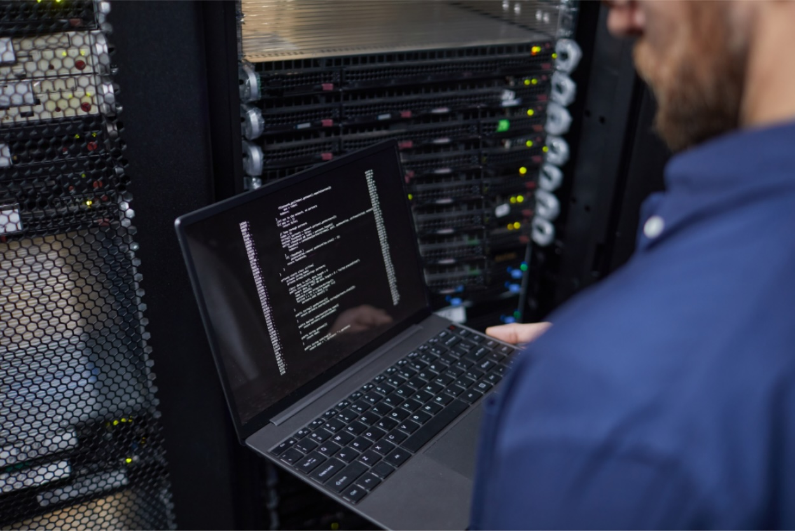
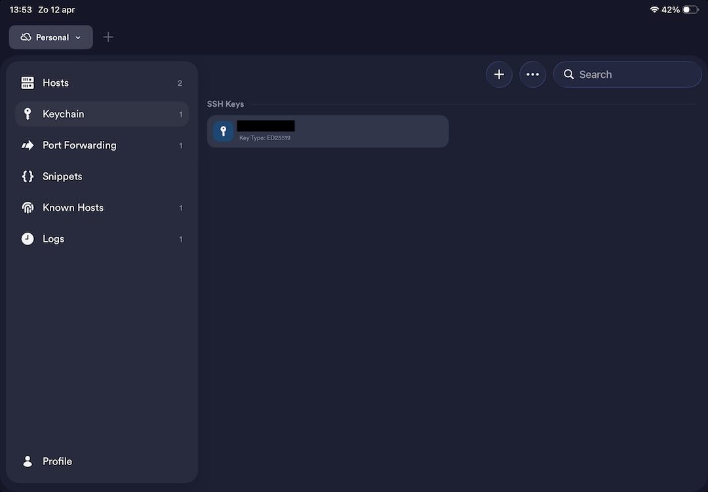
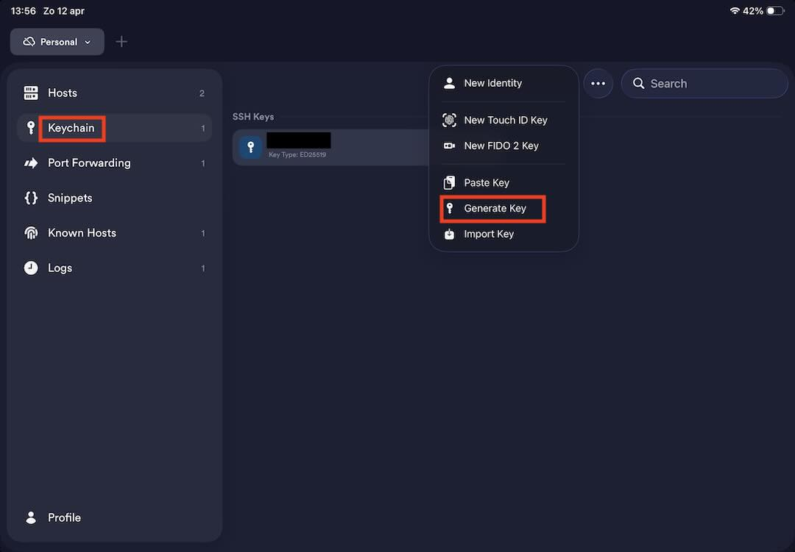
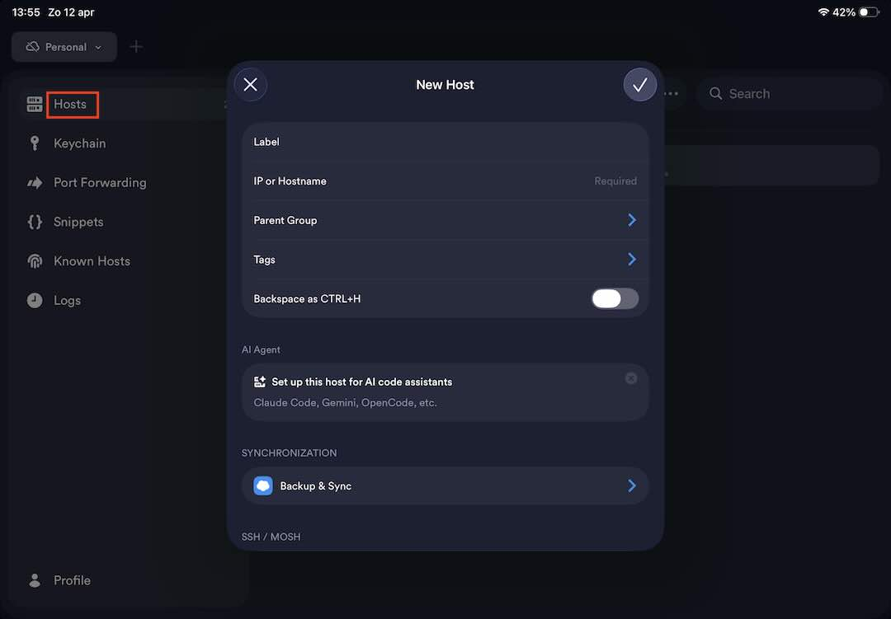
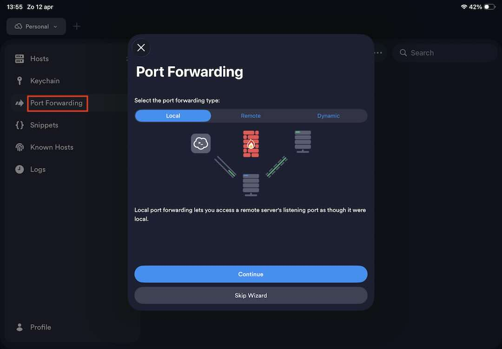

# SSH Tunnels

## proloog

Ik heb thuis een **mac mini** ingericht als **file http server** en deze host ook **gitweb** en **Ontwikkelaars documentatie** dat ik, indien nodig, toegang tot heb ook al is het internet uitgevallen (enkel thuis dan weliswaar).

Nu wil ik zolang het internet gewoon werkt ook toegang hebben vanaf een andere locatie dan thuis. Daarvoor heb ik wat research gedaan en **tailscale** is de gemakkelijkste oplossing. Maar tailscale is dan weer een extern bedrijf en ik heb liever alles zelf in handen plus de leerfactor telt ook mee ;-)

Uiteindelijk ben ik uitgekomen op **SSH Tunnels** en dit werkt zoals ik had gehoopt, het is wat omslachtiger dan **tailscale** maar dan heb ik alles zelf in handen.

Het grootste voordeel is dat je geen aanpassing moet doen aan je firewall thuis.

## Wat heb je nodig

Om je **lokale thuis server** te benaderen van buiten je netwerk heb je een tussenliggende **computer** of **server** nodig waar je overal toegang tot hebt. In mijn geval huur ik hosting bij een nederlands bedrijf, en die server dient als poortwachter.

Je hebt ook een **apparaat** nodig om op locatie in te loggen op de poortwachter **server**. Dit kan een **laptop**, **smartphone** of **tablet** zijn. In mijn geval gebruik ik een **iPad** met de app **termius**.

Ook moet je via je lokale **computer/server** een ssh verbinding hebben met de poortwachter **server**, liefst met **SSH Keys**.

Als laatste heb je dus ook **webhosting** nodig waar je **ssh** toegang hebt tot de server, anders werkt dit niet.

## een reverse tunnel aanmaken

Op de lokale **computer** of **server** moet je een **reversed tunnel** maken naar je publieke **server** die als poortwachter dient. Dit kan met volgend commando op de lokale **computer/server**.

	ssh -R localhost:8888:localhost:8080 John@example.com
	
Hier is de eerste localhost:8888 de poort op je poortwachter **server**. De tweede localhost:8080 is de poort op je lokale **computer/server**. De localhost is omdat je dan in de browser op je **iPad** gewoon "localhost:8888" kunt typen en dan krijg je de lokale **website** te zien, in mijn geval het portaal. Waar ik dan de **file http server** en de **ontwikkelaars Documentatie** kan bekijken precies alsof ik gewoon thuis ben.
Het laatste deel is de poortwachter **server** adres en gebruikersnaam, hiermee log je als het ware in op de poortwachter **server**.

## een local tunnel aanmaken

Het tweede ga ik even uitleggen op een **computer** die je buitenshuis gebruikt. Daar moet je een **local tunnel** aanmaken naar de poortwachter **server**. Dit doe je met een vergelijkbaar commando

	ssh -L loclahost:8888:localhost:8888 john@example.com

Let op de "-L" dit zegt dat je een local tunnel wilt opbouwen. Als je alles correct hebt ingesteld dan kun je in je browser gewoon "localhost:8888" typen en krijg je de website te zien op je lokale **computer/server**.

## uitleg in verband met de poorten

Ik heb hier op de lokale **computer/server** gekozen voor poort 8080 waarop de webserver luistert. Dit is omdat je normaal voor poort 80 op je poortwachter **server** de **sshd_conf** moet aanpassen. Specifiek het gedeelte van **GatewayPorts** hier moet je **yes** achter zetten in plaats van **no**. Maar omdat ik dit op mijn webhosting niet kan aanpassen heb ik gekozen voor een andere poort.

## Termius app op iPadOS

Op mijn **iPad** heb ik gekozen voor de app **termius** om port forwarding te kunnen bewerkstelligen.

Als eerste moet je een **ssh key** aanmaken en de publieke sleutel op de poortwachter **server** toevoegen aan het **authorized_keys** bestand. Eens dat in orde is kun je de verbinding aanmaken.

Bij "hosts" ga je een verbinding aanmaken met de poortwachter **server**. Hier moet je al je gegevens invullen om via **ssh** een verbinding te kunnen maken. In plaats van een paswoord kies je hier je **ssh key** die je net hebt aangemaakt. Verder vul je het IP of hostname adres in en kies je voor verbinding met **ssh**.

Als dat in orde is kun je testen of je via je **iPad** met **ssh** kunt inloggen op je poortwachter **server**. Als het werkt dan zie je een **command prompt** van je **server**.

Nu moet je nog enkel **Port Forwarding** instellen in **termius**.
Daar vul je de correcte gegevens in, als **bind address** adres vul je localhost in en bij **Port** 8888. Bij **intermediate host** vul je je gebruikersnaam met het ip adres of hostname in.

	john@example.com:22
	

	
Als je dit allemaal correct hebt ingevuld klik je op de net aangemaakt **local forwarding** en dan ga je in je browser gewoon het volgende invullen

	http://localhost:8888
	
En voila nu heb je verbinding met een website op je lokale **computer/server** van buitenshuis.

## epiloog

Dit kun je ook doen om bijvoorbeeld **remote desktop** te gebruiken (VNC), dan moet je gewoon de juiste poort instellen en via een **VNC** app op je **iPad** kun je dan je lokale **computer** bedienen. Als je zoals mij een lokale **mac computer** gebruikt en een **mac laptop** buitenshuis heb je geen extra app nodig dat zit ingebakken in **macOS**. Enkel de juiste **ssh tunnels** aanmaken.