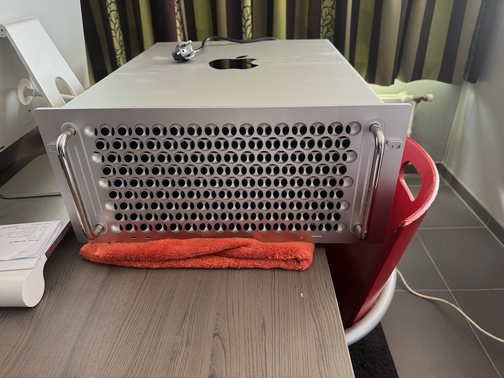
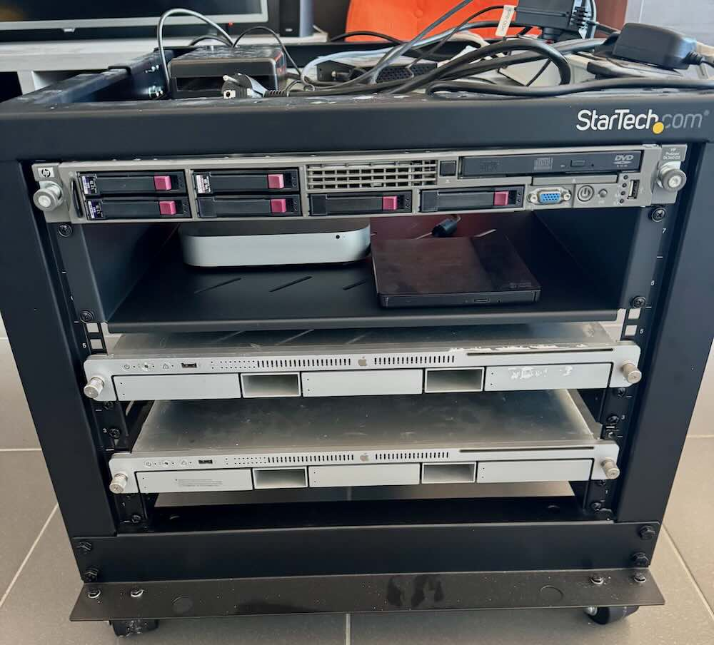

# Aankoop Mac Pro 2019 Rack

## Huidige situatie servers

Op het moment heb ik 2 **servers**, een **HP Proliant DL360 G5** en een **Apple XServe 2008**, werkend. Deze worden gebruikt voor het opslaan van en het **streamen** van **TV Shows** en **Films**.

Beide **servers** worden enkel opgezet als ik een aflevering van een **TV Show** of **Film** wil zien, dus het verbruik valt wel mee. Maar ze verbruiken elk een 20 watt aan standby. Dat is 350,4Kwh per jaar enkel om ingeplugd te zijn.

Daarnaast heb ik een **mac mini 2014** die dient als **File server**. Dit zijn bestanden zoals bepaalde versies van programma's of **documentatie** voor het **programmeren**, maar ook al mijn **eBooks** en wat andere bestanden, al bij al een 350GB.

Deze **mac mini 2014** start op om 8u 's morgens en gaat af om 22u 's avonds. Op die momenten verbuikt hij een 25 watt, dat is 127,75 Kwh per jaar.

Samen is dat dus 478,15 Kwh per jaar. Dit wil ik niet noodzakelijk naar beneden halen, maar evenaren zou al goed zijn met 1 **server**.

Zowel de **servers** als de **mac mini** hebben ook al hun leeftijd, vooral de **servers** dan. Dus wil ik nu iets nieuwer.

## Mac Pro 2019 Rack

Ik was zoals regelmatig per toeval op de site van [Refurbed](https://www.refurbed.be) aan het kijken en zag daar een **Mac Pro 2019 Rack** versie staan voor 1699€. Deze sprak mij direct aan, een **krachtige**, **uitbreidbare** computer met bonus punten voor goede **looks**.

Dus ben ik research gaan doen. Ik heb een week liggen twijfelen of ik hem wel of niet zou kopen, na een week dan toch de knoop doorgehakt en besteld.

Deze versie had

- Xeon W3235 CPU
- 32GB Ram
- 256GB SSD
- Radeon 580x

De **SSD** is wat klein, maar voor dat probleem heb ik een oplossing.

## Gebruik Mac Pro 2019 Rack

Nu wil ik deze voor 4 dingen gaan gebruiken. Allereerst voor de opslag van **TV Shows** en **Films**. Dit gaat door een **Sonnet J3i** module gebeuren, deze kan 2x **3.5"** **harde schijven** bevatten en 1x **2.5"** **harde schijf**.

Een tweede bestaansreden is voor het installeren van **VMs**. Ik heb een paar **VMs** met linux die ik gebruik om te experimenteren en dat zou ik verder willen zetten.

Een derde reden is **lokale AI**, ik ben ook aan het experimenteren met **lokale AI**, voorlopig nog op mijn **MacBook Pro M1 Pro**, maar ik wil een aparte **computer** voor die experimenten. Hierdoor hang ik bij een volgende laptop niet vast aan de **Geheugen eisen** en kan ik dus een **MacBook Air** of zelfs een **MacBook Neo** kopen in plaats van een uitgebreide **MacBook Pro**.

En een laatste reden is dat ik de **Mac Pro 2019 Rack** wil gebruiken voor **File server**. Daarvoor heb ik een **NVMe SSD** en **PCIe kaart** besteld.

## lokale AI

Hier geldt hoe meer **geheugenbandbreedte** hoe beter. Nu was ik benieuwd naar het aantal **tokens per seconde** voor een model zoals **Gemma4 12b Q4_K_M**, en dat valt mee te vallen. Ik heb hier ongeveer **6 - 8 tokens/seconde**, wat in mijn ogen snel genoeg is om mee aan de slag te gaan. Dat is iets sneller dan dat je kunt meelezen.

Maar het mooie van de **Mac Pro 2019 Rack** is dat deze uit te breiden is met 2 specifieke **GPUs** namelijk de **Radeon Vega II met 32GB VRAM** of de **Radeon Pro W5700X met 16GB VRAM**. en er kunnen 2 **GPUs** in voor een totaal van **32 of 64GB VRAM**.

Maar dat is voor de toekomst.

## conclusie

In mijn ogen heb ik een goede deal gedaan met deze **Mac Pro 2019 Rack** en als de **macOS** versie te oud wordt kan ik er gewoon mee verder met **Linux**.

Het was dan wel een heftige aankoop, maar daar spaar ik dus voor, om zulke dingen te kunnen kopen.

Verwacht nog een **blog post** specifiek ivm **lokale AI**, waar ik wat spreadsheets deel die ik gemaakt heb met de resultaten qua snelheid.